# Zatamap High-Level Design

## Exchange-time market data, strategy integration, kernel-governed trade authority, and multi-mode execution

**Document class:** High-Level Design (HLD)<br>
**Status:** Engineering preprint<br>
**Strategy reference:** `zatamap-trade-api@11ad49ec87362aa066afa76997cb3506b28bf076`<br>
**Replay-lineage reference:** `zatamap-feed@1db42c007c9998d6a6fb444cc2f1ad83f72c891e`<br>
**Revision:** 1.0 — 19 August 2026

[Strategy white paper](../strategy-system/README.md) ·
[Central Trade Authority Kernel](../strategy-system/CTAK.md) ·
[Reproducibility protocol](../strategy-system/REPRODUCIBILITY.md)

> This document explains software architecture and control boundaries. It is
> not investment advice, a profitability claim, or a substitute for an
> independently reviewed production-readiness assessment.

## 1. Executive overview

Zatamap is an event-driven directional index-option trading platform. Its
central architectural idea is that a market observation, a trading signal, a
policy decision, permission to trade, and an external order are five different
things. They must never be represented by one mutable boolean or one strategy
function.

The system therefore separates:

1. **market-data authority** — obtain, normalize, order, persist, and publish
   exchange observations;
2. **feature and strategy production** — describe what the market appears to
   be doing;
3. **temporal and current-market policy** — determine whether evidence is
   continuous, current, structurally admissible, and bound to one candidate;
4. **trade authority** — authenticate exact identity and grant narrowly scoped
   capabilities through the Central Trade Authority Kernel (CTAK);
5. **execution** — perform the authorized effect through a broker or a
   database-simulated provider; and
6. **position lifecycle** — evaluate the exact held position, authorize an
   exit, confirm the close, and retire ownership.

Live, paper, and historical replay use the same market callback and strategy
path. They differ only at explicitly typed transport and provider boundaries.
Exchange time is the sole strategy clock in every mode.

## 2. Design goals

The architecture is designed to satisfy the following goals.

- **One market interpretation:** identical ordered exchange observations and
  identical initial state should produce identical strategy decisions.
- **One authenticated trade boundary:** no detector, cache, tag, or log message
  can submit an automated order by itself.
- **Exact identity:** side, token, symbol, session, user, episode, and exchange
  timestamp remain bound throughout a decision.
- **Causal temporal reasoning:** later evidence may confirm earlier evidence;
  future observations may never alter an earlier decision.
- **Mode safety:** live uses broker execution; paper and backtest use database
  simulation. A missing mode configuration must not silently enable live
  orders.
- **Replay lineage:** historical replay preserves the original provider frame,
  sequence, and packet position instead of inventing a new tick order.
- **Operational containment:** token refresh, connection health, persistence,
  and NATS delivery failures cannot manufacture strategy evidence.
- **Auditability:** an order can be traced from exchange packet to decision
  frame, evidence episode, authorization receipt, submission, and fill.

## 3. Non-goals

This design does not claim:

- that any strategy is profitable or statistically optimal;
- that paper fills reproduce broker latency, slippage, rejection, or partial
  fills;
- that every legacy route-local calculation has already moved into a small
  module;
- that a hash proves the economic truth of source data; or
- that old historical ticks can recover lineage fields that were never stored.

## 4. Architectural principles

### 4.1 Facts are not authority

A detector may state that a setup is supported. The Market-Time Evidence
Authority (MTEA) may state that support is continuous. The Central Decision
Engine (CDE) may state that the current market is admissible. None of these
statements alone is permission to place an order.

### 4.2 Authority is capability-based

CTAK grants a named capability, such as `ENTRY_AUTHORIZATION` or
`EXIT_AUTHORIZATION`, for one exact identity and exchange timestamp. A
capability cannot be inferred from a strategy name, a diagnostic string, or an
all-true dictionary.

### 4.3 The kernel is pure; adapters perform effects

The CTAK core contains immutable values, hashes, verification rules, and legal
lifecycle transitions. It does not access the broker, database, NATS, process
clock, environment, or logging system. Effectful adapters gather facts before
the kernel and execute authorized actions after it.

### 4.4 Exchange time is strategy time

NATS receive time, NATS publish time, database insertion time, process time,
wall time, and monotonic time are operational facts. They may control health,
retry, pacing, or consumer positioning, but never market-state progression.

### 4.5 Identity changes require new proof

Evidence for one option strike does not authorize another strike. Call
European (CE) evidence does not authorize a Put European (PE) order. Evidence
from one session, user, trade mode, or temporal episode cannot silently cross
into another.

### 4.6 Fail closed at authority boundaries

Missing timestamps, ambiguous tokens, invalid lineage, stale receipts,
incomplete position identity, and illegal state transitions produce WAIT or
REJECT. They do not trigger a fallback order route.

## 5. System context

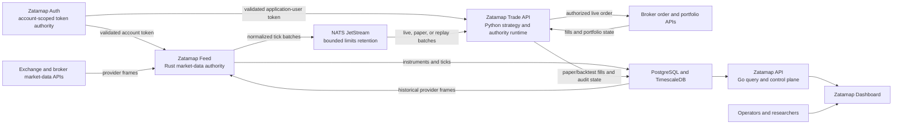

The diagram contains two distinct broker relationships:

- `zatamap-feed` owns the steady-state broker WebSocket for tick delivery;
- the live Python engine retains broker REST access for instruments, orders,
  positions, margins, and reconciliation.

The direct Python broker WebSocket remains an explicit rollback compatibility
mode. It is not an implicit fallback when NATS is unavailable.

## 6. Service and component responsibilities

| Component | Owns | Must not own |
| --- | --- | --- |
| Zatamap Auth | Account-scoped token generation, validation, storage, renewal coordination | Market direction or order policy |
| Zatamap Feed | Provider connection, instrument universe, normalization, exchange-time lineage, tick persistence, NATS publication | Strategy decisions or orders |
| NATS JetStream | Retained ordered transport and consumer isolation | Strategy time or market truth |
| TimescaleDB | Historical instruments, ticks, audit records, and replay source data | Implicit trade authority |
| Runtime Context | Explicit trade mode, tick source, order provider, position provider, and margin provider | Strategy thresholds |
| NATS Ticker | Contract validation and adaptation to the shared tick callback | Timestamp invention or strategy filtering based on wall lag |
| Strategy producers | Bounded market evidence | Candidate-wide order permission |
| Market-Time Evidence Authority | Exchange-time continuity and exact candidate reservation | Current-market policy or order submission |
| Central Decision Engine | Current market, structure, portfolio, and session admissibility | Temporal history invention or execution |
| Central Trade Authority Kernel | Identity, receipt, capability, and lifecycle verification | Indicators, broker calls, persistence, or profitability policy |
| Position Exit Evidence Ledger | Current and cross-tick evidence for the exact owned position | Ordinary discretionary close execution |
| PEL Thesis Lifecycle | Owned-position thesis state and ordinary discretionary exit authorization | Provider fill assumptions |
| Execution adapters | Broker or database effect after authority verification | Strategy inference |
| Go API and Dashboard | Read models, control surfaces, and visualization | Trading capability creation |

## 7. Logical layered architecture

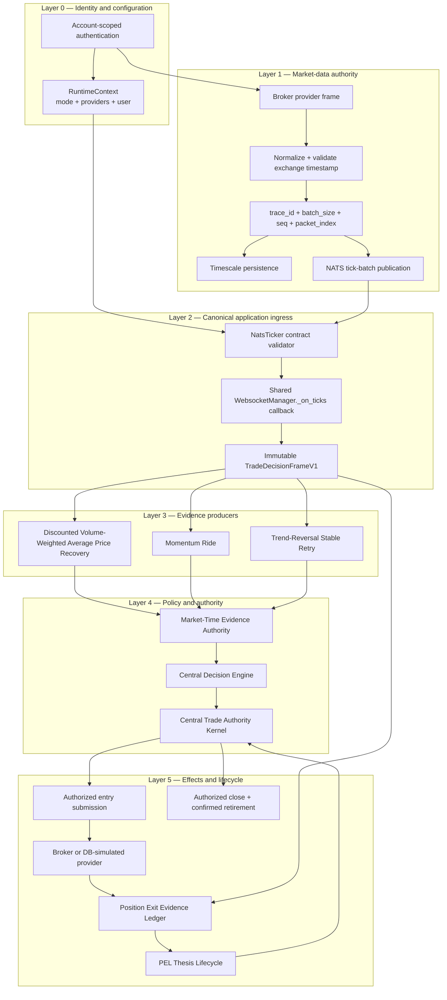

Layers describe authority, not necessarily one file or process. The current
Python orchestration module remains intentionally wrapped by typed authority
adapters while responsibilities are progressively extracted.

## 8. Market-data data-flow design

### 8.1 Live and paper flow

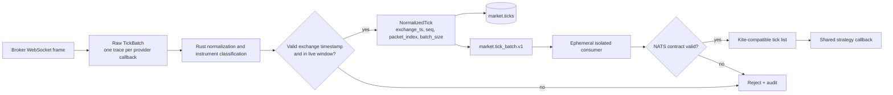

The feed subscribes and persists within the exchange-data window from 09:00 to
15:30 India Standard Time on valid trading days. Strategy order-admission
hours remain a separate policy. A data window must never be treated as order
permission.

### 8.2 Canonical tick lineage

The provider-frame identity is:

```text
trace_id       one provider callback frame
batch_size     original number of packets in that frame
seq            strictly increasing feed-ingestion sequence
packet_index   original zero-based packet position inside the frame
exchange_ts    exchange-reported market time for the individual packet
```

`trace_id`, `seq`, and `packet_index` preserve provider delivery lineage.
`exchange_ts` advances strategy state. Receive, publish, insert, and process
timestamps remain operational metadata.

### 8.3 Historical replay flow

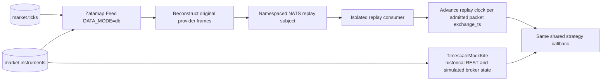

Replay does not group rows by exchange second, promote spot ahead of option
packets, or sort by database insertion time. A provider frame may contain
adjacent exchange timestamps. The callback begins at the first admitted
packet's exchange time and advances once per packet in original order.

## 9. Immutable decision frame

`TradeDecisionFrameV1` is the application-level boundary between mutable tick
processing and trade authority. It contains:

- user, session date, and trade mode;
- exchange timestamp and callback sequence;
- current NIFTY spot snapshot;
- exact option snapshots with side, token, symbol, strike, Last Traded Price
  (LTP), Volume-Weighted Average Price (VWAP), volume, and Open Interest (OI);
- instrument, underlying, and optional convexity references; and
- a deterministic content hash.

An exact lookup succeeds only when one observation matches side, token, and
symbol. Ambiguity or mismatch is terminal for that authority attempt.

## 10. Strategy-producer integration

The three strategy families are evidence producers with different scopes.

| Producer | Primary input | Initial scope | Question answered |
| --- | --- | --- | --- |
| Discounted Volume-Weighted Average Price Recovery (DVR) | Exact option premium versus its own VWAP, recovery path, spot confirmation, opposite side | Exact token | Is a discounted option repairing with usable directional runway? |
| Momentum Ride | NIFTY displacement, velocity, persistence, and sponsorship | Side, then exact token | Is the underlying sustaining a directional continuation that can later materialize into an executable contract? |
| Trend-Reversal (TR) Stable Retry | Current option readiness, prior block/flip, temporal continuity, wall and structure state | Exact token | Has a previously blocked or incomplete setup earned a current safe retry? |

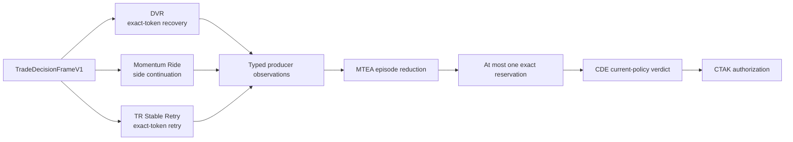

Producer agreement is not a vote that bypasses policy. Agreement can
strengthen temporal evidence; disagreement remains visible. Current Layer 1
through Layer 4 structure, ownership, risk, quote, and exact-token checks still
apply.

## 11. Entry authority flow

```mermaid
sequenceDiagram
    participant T as Tick ingress
    participant F as Decision frame
    participant S as Strategy producers
    participant M as Market-Time Evidence Authority
    participant C as Central Decision Engine
    participant K as Central Trade Authority Kernel
    participant A as Entry adapter
    participant P as Broker or DB provider

    T->>F: Build immutable exchange-time frame
    F->>S: Supply current exact observations
    S->>M: Publish typed SUPPORT, WAIT, or CONTRADICTION
    M->>M: Reduce source-neutral exchange-time episode
    M->>M: Reserve one exact candidate
    M->>C: Present candidate and current frame
    C-->>M: APPROVE, WAIT, or HARD_REJECT with reasons
    M->>K: Present frame, reservation, verdict, quote, owner, and provenance
    K->>K: Verify hashes, identity, market time, and legal transition
    alt Authority complete
        K-->>A: ENTRY_AUTHORIZATION capability
        A->>P: Submit exact authorized order
        P-->>A: Fill, partial fill, reject, or uncertainty
        A->>K: Confirm reconciled execution outcome
    else Authority incomplete
        K-->>A: No capability; fail closed
    end
```

### 11.1 Required entry conjunction

An automated entry effect is legal only when the exact conjunction is true:

```text
verified frame
AND causal MTEA episode
AND exact candidate reservation
AND current CDE approval
AND current quote and owner authority
AND valid CTAK entry capability
AND legal lifecycle transition
```

No single producer owns this conjunction.

The sequence is the final authority order, not a claim that every diagnostic is
computed only once. Runtime code may calculate tentative current-policy facts
earlier for observability. The final cutover re-authenticates the Central
Decision Engine verdict against the same immutable frame and exact Market-Time
Evidence Authority reservation before CTAK can issue a capability.

## 12. Role of the Central Decision Engine

The Central Decision Engine owns current-market policy. It evaluates:

- coordinator state such as `MOMENTUM_UP`, `MOMENTUM_DOWN`, `RANGE`, or
  `EXHAUSTING`;
- position conflict and directional alignment;
- current Layer 1 underlying direction;
- cumulative Layer 2 participation;
- Layer 3 selected-option quality;
- Layer 4 support, resistance, and location;
- cooldown and session policy; and
- optional expiry and convexity context where explicitly authoritative.

CDE does not reconstruct temporal history, select an arbitrary sibling strike,
or place an order. An approval is a signed policy fact consumed by CTAK; it is
not itself an execution capability.

## 13. Role of the Market-Time Evidence Authority

The Market-Time Evidence Authority owns temporal causality:

- exchange-time bucketing and continuity;
- separation of side evidence from exact-token evidence;
- episode creation, ageing, contradiction, and invalidation;
- exact candidate reservation;
- rejection debt and independent later-bucket recovery;
- owner-transfer and same-token recovery proofs;
- wall-break continuation receipts; and
- atomic reservation reselection.

MTEA answers “has this evidence earned temporal continuity, and to which exact
candidate does it belong?” It does not answer “is the current market safe?” or
“may an order be submitted?”

## 14. Role of the Central Trade Authority Kernel

### 14.1 Why a kernel-based design

In a conventional strategy application, detectors often call order functions
directly. As the number of strategies grows, every route accumulates its own
interpretation of cooldown, candidate identity, ownership, retry, and exit.
The result is multiple competing trade authorities.

CTAK replaces that implicit authority with a small capability kernel. The
kernel is analogous to a security reference monitor:

- all automated trade effects pass through it;
- authority is explicit, narrow, and verifiable;
- identity and time are bound to every receipt;
- lifecycle transitions are enumerated; and
- invalid or missing proof fails closed.

This is a kernel-based design because the central mechanism is intentionally
smaller and more stable than the strategies around it. Strategies may evolve;
the rules for who may authorize an effect should remain centralized.

### 14.2 Kernel capabilities

The reviewed kernel defines these capabilities:

| Capability | Meaning |
| --- | --- |
| `ENTRY_EVIDENCE` | Observe bounded entry evidence |
| `ENTRY_RESERVATION` | Bind one exact entry candidate |
| `ENTRY_AUTHORIZATION` | Authorize the exact entry decision |
| `ENTRY_EXECUTION` | Confirm the entry execution boundary |
| `CANDIDATE_INVALIDATION` | Invalidate a candidate through a typed path |
| `POSITION_OWNERSHIP` | Own the exact filled position |
| `POSITION_RELEASE` | Release position authority |
| `POSITION_TRANSFER` | Transfer exact position ownership |
| `EXIT_EVIDENCE` | Observe exact-position exit evidence |
| `EXIT_AUTHORIZATION` | Authorize an exact close |
| `EXIT_EXECUTION` | Confirm the close execution boundary |
| `HARD_RISK` | Invoke a categorical risk authority |

Capabilities are non-transitive. Possessing `ENTRY_EVIDENCE` does not imply
`ENTRY_RESERVATION`; reservation does not imply authorization; authorization
does not prove a fill.

### 14.3 Kernel lifecycle

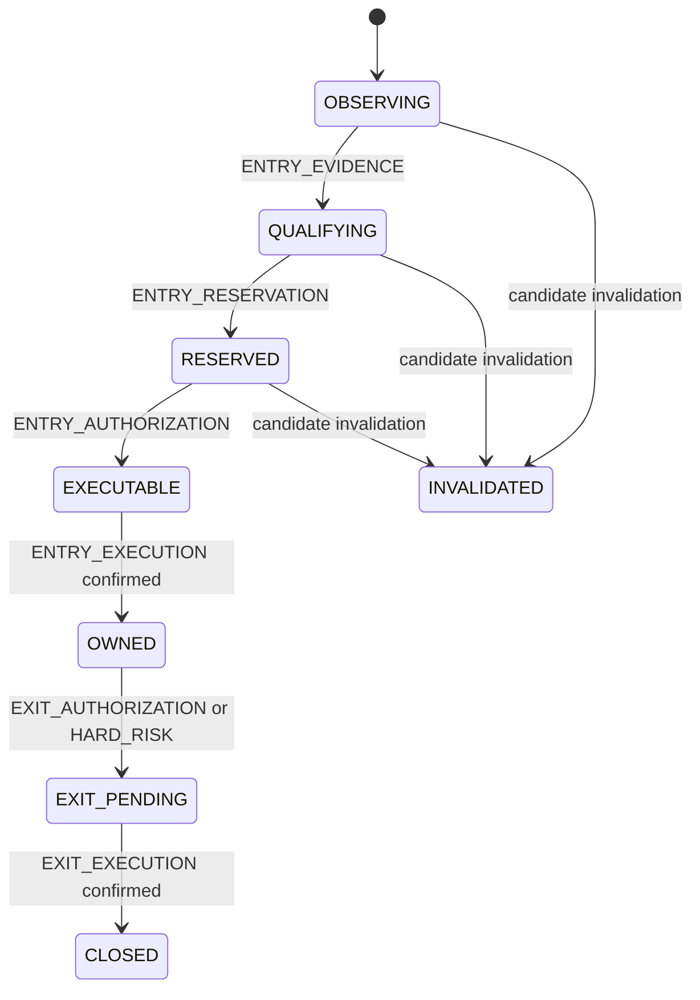

The kernel rejects transitions that skip required capabilities. A position is
not `OWNED` merely because an order was submitted, and it is not `CLOSED`
merely because a close was requested.

### 14.4 Exact authority identity

`TradeAuthorityIdentityV1` binds:

```text
user_id + session_date + episode_id + market_ts
    + optional atomic group(side + token + symbol)
```

For exact-instrument capabilities, side, token, and symbol must all be present
or all be absent. Partial exact identity is invalid.

### 14.5 Receipt construction

A CTAK receipt binds:

- kernel version;
- capability;
- authority owner;
- exact trade identity;
- source authority class;
- deterministic source-payload hash;
- issue exchange time;
- optional exchange-time validity boundary; and
- deterministic receipt hash.

Formally:

\[
Effect(x) \Rightarrow
Verify(Frame_x \land Identity_x \land Receipt_x \land Transition_x).
\]

The reverse implication is false: a valid market signal does not imply an
external effect.

### 14.6 What CTAK deliberately does not do

CTAK does not:

- calculate VWAP, implied volatility, delta, gamma, theta, or indicators;
- decide whether DVR, Momentum Ride, or Stable Retry is economically sound;
- connect to NATS or the broker;
- query TimescaleDB;
- generate or refresh access tokens;
- infer current time from the process clock; or
- assume a submission was filled.

These exclusions keep the kernel deterministic and independently testable.

## 15. Atomic candidate selection

An armed reservation cannot use one strike's wall identity while a cleaner
sibling strike supplies Layer 3 or quote facts. A sibling may be observed, but
its observation is non-executable. Only central reservation reselection can
atomically replace the exact side, token, symbol, quote, and wall identity.

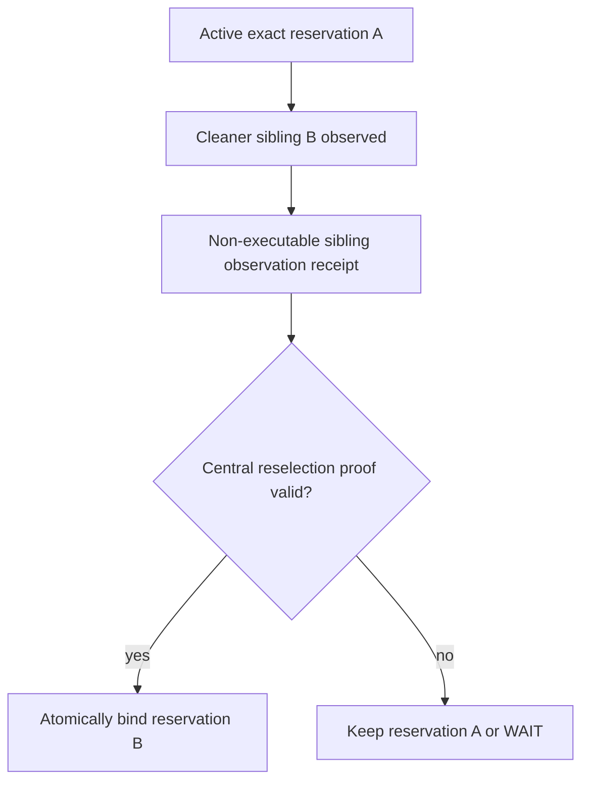

This prevents mixed-token decisions that look individually plausible but have
no coherent end-to-end identity.

## 16. Position evidence and exit architecture

Entry authorization ends when the position is reconciled. From that point,
exit authority is separated into evidence and thesis state.

- The **Position Exit Evidence Ledger (PEL)** owns exact-position current and
  cross-tick evidence.
- The **PEL Thesis Lifecycle (PTL)** consumes PEL evidence, owns the thesis
  state, and may issue ordinary discretionary exit authorization.
- The execution adapter performs the close and retains ownership until the
  provider outcome is confirmed.

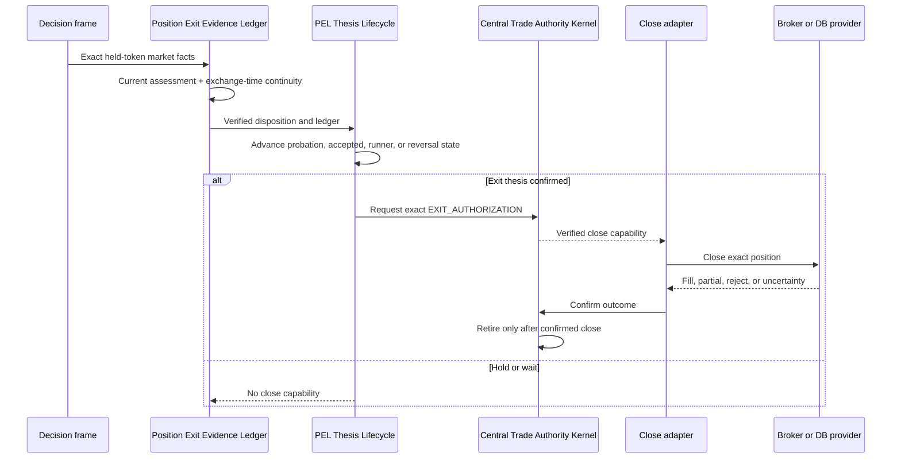

Categorical hard-risk, end-of-day, manual, and reconciliation paths remain
explicit authorities. They do not masquerade as ordinary strategy evidence.

## 17. Runtime-mode architecture

`RuntimeContext` makes transport and provider choices explicit.

| Mode | Tick source | Order provider | Position provider | Margin provider |
| --- | --- | --- | --- | --- |
| Live | NATS tick batch by default; direct WebSocket only as explicit rollback | Broker | Broker | Broker |
| Paper trade | Live NATS tick batch | Database simulated | Database | Database |
| Backtest, NATS replay | Replayed NATS tick batch | Database simulated | Database | Database |
| Backtest, compatibility | Direct database/CSV mock ticker | Database simulated | Database | Database |

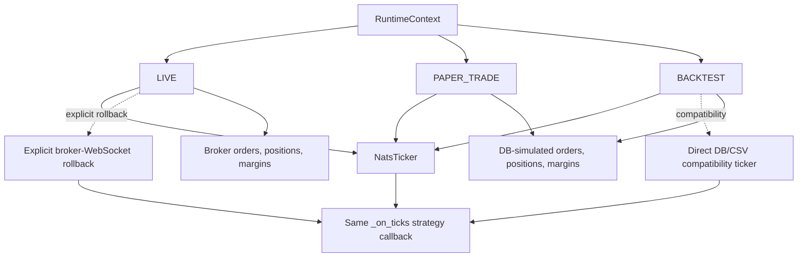

Tick source does not determine whether orders are live. The typed order
provider does. This prevents “NATS means paper” or “REST client exists means
live” assumptions from leaking into deep order code.

## 18. Authentication and account isolation

Zatamap Auth is the centralized credential authority. The intended startup
protocol is:

1. resolve the explicitly configured application or feed account;
2. select the latest usable account-scoped token from the central auth view;
3. validate it with the broker;
4. if invalid or near expiry, request renewal only for that account;
5. reload and revalidate the newly stored token; and
6. distribute the resulting REST client within that process.

The following are prohibited design patterns:

- “login all users” during one process startup;
- refreshing a different account because one account failed;
- choosing an account through a source-specific default;
- allowing paper mode to reach a broker order method; and
- allowing token refresh to mutate strategy time or evidence.

Legacy application-local login flows should be treated as compatibility debt;
the target boundary is one account-scoped authority service and read-only token
consumption by feed and trade runtimes.

## 19. Persistence architecture

| Store or table family | Primary content | Authority role |
| --- | --- | --- |
| Central auth tables/view | Broker credentials, current token, token metadata | Credential authority only |
| `market.instruments` | Dated instrument catalog, strike, type, expiry, lot and tick size | Instrument identity and replay metadata |
| `market.ticks` | Exchange ticks plus provider lineage and market fields | Historical market-data source |
| `trade.orders_book` | Order intent and fill record | Execution record, not strategy evidence by itself |
| `trade.orders_tracker` | Current database-simulated open position | Paper/backtest position provider |
| `trade.trail_data` | Exchange-time position trail observations | Position analysis and chart history |
| `trade.trail_summary_day` | Best/worst and summarized trade excursion | Historical summary/read model |
| `trade.fusion_events` | Decision and reason telemetry | Audit and root-cause analysis |
| audit event storage | Cross-service trace events | Lineage and operational evidence |

Open-position caches may accelerate the tick path, but database truth is
reconciled at order boundaries. A cache hit or miss cannot create an order
capability.

## 20. Deployment view

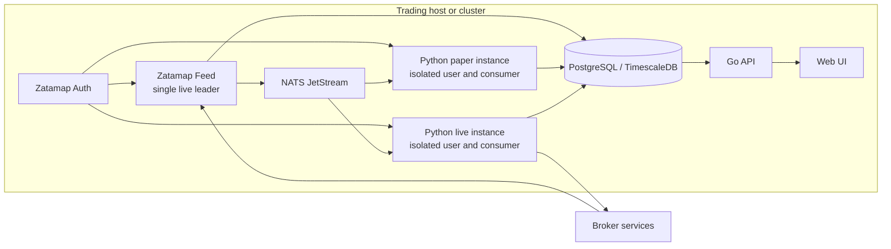

Production properties:

- a database leadership guard prevents multiple live feed leaders;
- live and paper use independent consumers and explicit users;
- paper and backtest broker-order tripwires fail closed;
- JetStream uses bounded file-backed limits retention;
- no inactive durable consumer is shared between live and paper; and
- service health/restart mechanisms must not restart an unrelated trade mode.

## 21. Parallel backtest architecture

Parallel replay is safe only when each run has isolated identities.

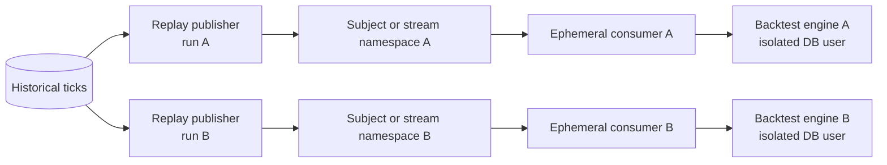

Each run requires:

- a unique run identifier;
- an isolated NATS subject/stream or equivalent proven filter boundary;
- an ephemeral or unique consumer;
- an isolated backtest user and user-scoped cleanup;
- one replay date and initial state per engine process; and
- result records tagged with commit, configuration, dataset, and run identity.

Multiple replay publishers must never interleave different dates on the same
unqualified subject consumed by one engine.

## 22. Failure containment

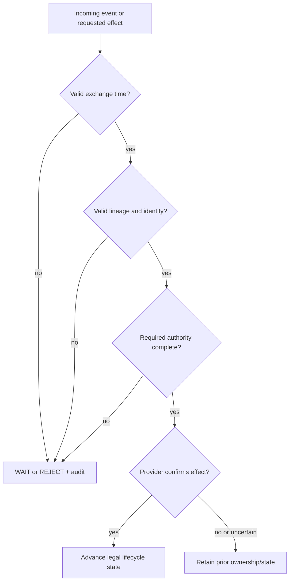

| Failure | Containment behavior |
| --- | --- |
| Broker tick lacks valid exchange timestamp | Reject as strategy input; never substitute receive or process time |
| NATS backlog | Continue in retained provider order; do not drop valid batches because of wall-clock lag |
| Unsafe JetStream retention | Refuse market-data authority handoff |
| NATS unavailable | No implicit direct-WebSocket trading fallback; alert and fail closed unless rollback is explicitly selected |
| Tick database persistence failure | Alert independently from transport; do not invent replay completeness |
| Token invalid | Refresh only the failed account through central authority |
| Instrument universe expired/incomplete | Fail readiness before subscription/trading |
| Ambiguous candidate or sibling mismatch | Keep current reservation or WAIT; require atomic reselection |
| Broker submission uncertain | Reconcile exact provider position before ownership transition |
| Close uncertain | Retain position ownership until close confirmation |
| Paper broker method reached | Tripwire and terminate the unsafe action |

## 23. Security and trust boundaries

The system contains four principal trust boundaries.

1. **Broker boundary:** external tokens, market packets, REST results, and fills
   are untrusted until validated and reconciled.
2. **Transport boundary:** NATS carries data but does not confer market or trade
   authority.
3. **Authority boundary:** only typed, hash-bound CTAK receipts may cross from
   policy into automated effects.
4. **Presentation boundary:** the Go API and UI expose read models and controls;
   they do not manufacture strategy capabilities.

Secrets, account identifiers, hosts, and personal paths must not be embedded in
public documentation, logs, replay artifacts, or capability payloads.

## 24. Observability model

Every incident investigation should be able to follow:

```text
provider trace
  -> normalized tick sequence
  -> NATS message
  -> decision frame
  -> strategy observation
  -> MTEA episode/reservation
  -> CDE verdict
  -> CTAK receipt
  -> order intent
  -> execution outcome
  -> PEL assessment
  -> PTL transition
  -> close confirmation and retirement
```

Minimum operational telemetry includes:

- service process identity, start time, restart count, and health;
- selected account, with sensitive token values masked;
- instrument counts and expiry distribution;
- first/latest exchange timestamp by asset class;
- tick, token, batch, persistence, and publication counts;
- NATS stream retention, age, bytes, and consumer pending depth;
- missing or invalid timestamp/lineage counts;
- decision reason codes and capability-verification failures;
- order submission and reconciliation outcomes; and
- exact-position PEL and PTL state transitions.

## 25. Architectural invariants

The following invariants are release gates.

1. No market-dependent strategy transition uses wall or process time.
2. No automated entry bypasses `submit_authorized_entry_v1` and the verified
   entry capability.
3. No ordinary discretionary exit bypasses PTL and exact exit authorization.
4. No exact capability is issued without atomic side, token, and symbol.
5. No position is retired before confirmed close reconciliation.
6. Paper and backtest cannot reach broker order methods.
7. Live and paper do not share a durable market-data consumer.
8. Replay preserves provider-frame lineage or is explicitly classified as
   degraded/non-parity data.
9. Expiry comes from instrument metadata, never a hard-coded weekday.
10. A token refresh affects only the explicitly failed account.

## 26. Adding a new strategy safely

A new strategy is integrated as a producer, not as another order authority.

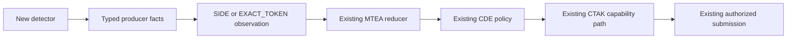

Required integration work:

1. define a falsifiable market thesis and explicit non-goals;
2. define side-scoped versus exact-token evidence;
3. create immutable producer facts and a typed adapter;
4. declare exchange-time continuity and invalidation rules;
5. reuse central candidate, quote, owner, CDE, CTAK, and execution contracts;
6. add CE/PE symmetry, stale, missing, cross-token, and wrong-mode negatives;
7. add deterministic replay parity tests; and
8. update the white paper, this HLD, seam registry, and source map.

The strategy must not add a direct call to the broker or database order path.

## 27. Current implementation and evolution boundary

The architecture distinguishes three statuses.

| Status | Meaning | Examples |
| --- | --- | --- |
| Normative | Required authority behavior | Exchange-time strategy clock, exact CTAK capability, PEL/PTL split |
| Implemented compatibility | Retained for rollback or older datasets | Direct broker WebSocket ticker, direct DB/CSV backtest ticker |
| Migration debt | Works but should converge on the central boundary | Large route orchestration surface, application-local login remnants, historical rows without complete lineage |

Compatibility code must not become an implicit runtime fallback. Selection is
explicit, logged, and testable.

## 28. Implementation traceability

Primary Python implementation surfaces:

- `runtime_context.py` — typed mode and provider selection
- `nats_ticker.py` — NATS contract validation and Kite-compatible adaptation
- `option_chain_main.py` — shared tick callback and transport handoff
- `fusion_signals.py` — current strategy orchestration
- `trade_authority/decision_frame.py` — immutable market decision frame
- `trade_authority/kernel.py` — CTAK capability and lifecycle kernel
- `trade_authority/entry/` — entry evidence, reservation, policy contracts, and
  execution confirmation
- `trade_authority/exit/` — PEL, PTL, exit authorization, execution, and
  retirement
- `trade_authority/adapters/` — effectful authority integration boundaries
- `entry_order_submission.py` — authorized automated entry submission
- `order_service_api.py` — broker/database execution and reconciliation

Primary Rust feed surfaces:

- `zatamap-feed/src/main.rs` — live/replay source selection, session window,
  routing, persistence, and publication
- `zatamap-feed/src/instruments.rs` — dynamic expiry-aware instrument universe
- `zatamap-feed/src/kite.rs` — broker market-data provider
- `zatamap-feed/src/stream.rs` — bounded JetStream configuration and tick-batch
  publication

## 29. Related technical documents

- [Strategy and Trade Authority White Paper](../strategy-system/README.md)
- [Discounted Volume-Weighted Average Price Recovery](../strategy-system/DVR.md)
- [Momentum Ride](../strategy-system/MOMENTUM_RIDE.md)
- [Trend-Reversal Stable Retry](../strategy-system/TR_STABLE_RETRY.md)
- [Central Decision Engine](../strategy-system/CDE.md)
- [Market-Time Evidence Authority](../strategy-system/MTEA.md)
- [Central Trade Authority Kernel](../strategy-system/CTAK.md)
- [Position Exit Evidence Ledger](../strategy-system/PEL.md)
- [PEL Thesis Lifecycle](../strategy-system/PTL.md)
- [Reproducibility and Review Protocol](../strategy-system/REPRODUCIBILITY.md)

## 30. Acronym glossary

| Acronym | Full form or meaning |
| --- | --- |
| API | Application Programming Interface |
| CDE | Central Decision Engine |
| CE | Call European option type |
| CTAK | Central Trade Authority Kernel |
| DB | Database |
| DVR | Discounted Volume-Weighted Average Price Recovery |
| HLD | High-Level Design |
| IV | Implied Volatility |
| LTP | Last Traded Price |
| MTEA | Market-Time Evidence Authority |
| NATS | Messaging and JetStream transport used by the platform |
| OI | Open Interest |
| PE | Put European option type |
| PEL | Position Exit Evidence Ledger |
| PTL | PEL Thesis Lifecycle |
| REST | Representational State Transfer |
| TR | Trend Reversal |
| UI | User Interface |
| VWAP | Volume-Weighted Average Price |
