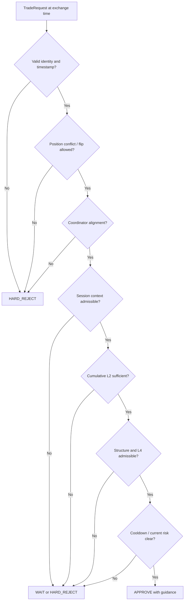
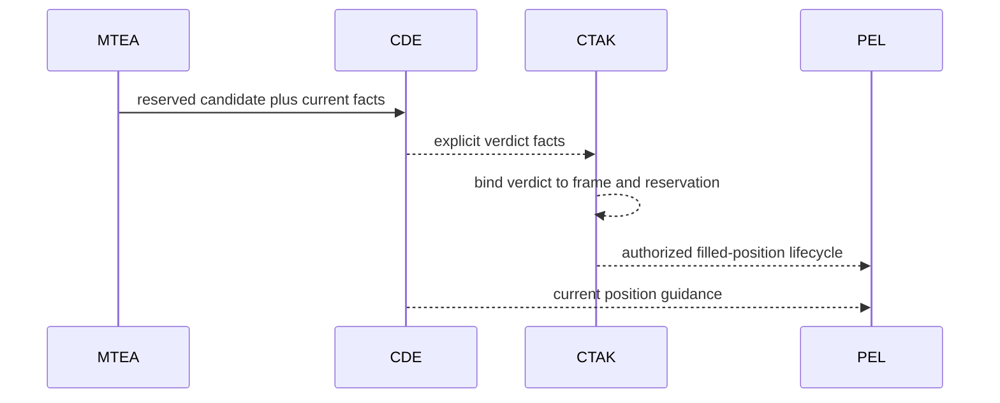

# Central Decision Engine (CDE)

[← Stable Retry](TR_STABLE_RETRY.md) · [White paper](README.md) · [MTEA →](MTEA.md)

**Component class:** Current-market policy evaluator and coordinator 
**Reference baseline:** `zatamap-trade-api@11ad49ec` 
**Order authority:** None

## Abstract

The Central Decision Engine evaluates whether a candidate proposed by an entry
producer is admissible under current portfolio conflict, coordinator regime,
session context, cumulative Layer 2 (L2) evidence, market structure, cooldown, and
optional convexity context. CDE is deliberately stateless with respect to
route-local evidence ownership: it consumes an explicit request timestamp and
returns a typed decision. Candidate reservation belongs to the Market-Time
Evidence Authority (MTEA); authenticated capability transitions and execution
governance belong to the Central Trade Authority Kernel (CTAK).

## 1. Formal role

For candidate \(c\), current frame \(F_t\), coordinator state \(z_t\), and
portfolio state \(p_t\), CDE evaluates

\[
D_t = \mathcal{C}(c,F_t,z_t,p_t) \in
\{APPROVE, WAIT, HARD\_REJECT\}.
\]

The output includes reason, priority, decision tag, and—when approved—position
ladder guidance. CDE does not infer missing candidate identity or use the
process clock.

## 2. Coordinator states

| State | Interpretation | Typical entry posture |
| --- | --- | --- |
| `MOMENTUM_UP` | Sustained upward directional state | Prefer CE continuation; scrutinize PE conflict |
| `MOMENTUM_DOWN` | Sustained downward directional state | Prefer PE continuation; scrutinize CE conflict |
| `RANGE` | Directional evidence not dominant | Demand stronger local/structural proof |
| `EXHAUSTING` | Existing move shows extension/fatigue | Raise continuation scrutiny and tighten lifecycle guidance |

State is contextual policy, not an executable signal.

## 3. Entry evaluation sequence

Only explicit `approved=True` is approval. Decision tags and reason strings are
diagnostics and cannot override the boolean verdict.

## 4. Request contract

A `TradeRequest` identifies strategy name, side, confidence, entry tag,
exchange timestamp, and structured current evidence. At the central CTAK
boundary, the completed verdict is additionally joined to exact token and
symbol supplied by the caller and authenticated against the decision frame and
MTEA reservation.

The exact identity join prevents an approval produced for one candidate from
being applied to another selected token.

## 5. Priority and arbitration

The reference strategy priority is:

1. Momentum Ride;
2. Range Scalp, currently dormant in the documented production profile;
3. Stable Retry;
4. DVR recovery and other bounded recovery paths.

Priority breaks competing proposals; it does not allow a high-priority
producer to bypass exact-token quality, ownership, hard risk, or CTAK.

## 6. WAIT versus categorical rejection

The distinction matters for temporal recovery.

- **WAIT** means current evidence is incomplete or temporarily insufficient.
  A later independent market bucket may recover it.
- **HARD_REJECT** means an identity, ownership, coordinator, or structural
  conflict has categorical significance and must be explicitly resolved.

Cumulative L2 weakness is ordinarily a current-tick veto rather than permanent
debt. Structural contradiction, exact position conflict, and malformed
identity are stronger classes. MTEA records the type; it does not flatten all
reasons into a rejection counter.

## 7. Strategy-specific treatment

| Producer | CDE treatment |
| --- | --- |
| Momentum Ride | Highest priority; narrowly defined breakout/session-extreme treatment may apply |
| Stable Retry | Additional scrutiny in `EXHAUSTING`; typed wall and basket evidence can support bounded paths |
| DVR | Current exact recovery and basket ignition are revalidated; no general recovery bypass exists |

Policy exceptions must name the evidence that justifies them and remain
symmetric for CE and PE.

## 8. Position guidance

CDE can return `HOLD_WIDE`, `HOLD_NORMAL`, `TIGHTEN`, or `EXIT_NOW` guidance,
plus ladder room and lock-related context. Guidance answers how current market
state should influence position management. It is consumed by TSL/PEL policy;
it is not itself a broker close command.

## 9. Cumulative-direction reconciliation

The latest baseline includes `CdeCumulativeDirectionAuthorityV2` for one narrow
case: fast raw trend is neutral, while CDE's independently accumulated L2 is
already same-side with MEDIUM or HIGH conviction. The receipt is active only
when current underlying authority, CDE verdict, exact side/token/symbol, and
exchange timestamp all match; the latched trend must be neutral or same-side,
and neither raw nor latched trend may be explicitly opposite.

This receipt reconciles classifiers. It does not grant entry, reuse the route's
trend label, or relax current L3/L4, lifecycle, ownership, quote, or risk policy.
When raw trend is already same-side, ordinary exact revalidation remains the
owner instead of the reconciliation path.

## 10. Authority boundary

CDE is the policy owner; CTAK authenticates the fact that CDE completed that
policy for the exact current identity.

## 11. Failure modes

| Failure | Control |
| --- | --- |
| Decision for one token applied to another | Exact side/token/symbol/timestamp join |
| Tag spelling interpreted as approval | Explicit boolean verdict owns outcome |
| Process-time cooldown | Request exchange timestamp only |
| Old L4 prose treated as structure | Typed canonical L4 receipt |
| Temporary L2 weakness becomes permanent | Typed WAIT distinct from categorical debt |
| Neutral raw trend conflicts with strong cumulative L2 | Exact same-tick V2 reconciliation, only without explicit fast opposition |
| CDE starts placing orders | Central authorized submission remains separate |

## 12. Observability

Every decision should record request identity, exchange timestamp, coordinator
state, position conflict, session classification, L2 result, structural result,
cooldown result, strategy-specific exception if any, verdict class, reason
code, and decision hash/trace.

## 13. Verification requirements

- one direct `evaluate_entry` seam;
- exact identity supplied by all callers;
- approved boolean cannot be spoofed by tag/reason;
- market-clock tests with replay dates far from the process date;
- coordinator-state and cumulative-direction tests;
- neutral-raw/same-latch/opposite-latch cumulative-direction matrices;
- DVR, Momentum, and Stable Retry handoff tests;
- current L4 receipt tests with stale/missing/prose-only negatives; and
- CE/PE symmetry matrices for every strategy-specific exception.

## 14. Scientific limitations

CDE encodes expert policy and correlated features; its decision is not a
probability unless separately calibrated. Priority can obscure the quality of
lower-ranked producers, and conditional bypasses increase multiple-testing
risk. Evaluation should publish per-reason confusion matrices, counterfactual
candidate outcomes, policy-ablation results, and regime-stratified coverage.

## Implementation map

- `central_decision_engine.py` — coordinator and entry/position policy
- `trade_authority/adapters/cde_entry_authorization.py` — runtime CDE-to-central-authority adapter
- `trade_authority/entry/entry_authorization.py` — typed CDE verdict and exact authorization contracts
- `trade_authority/entry/cde_cumulative_direction.py` — exact cumulative-L2 reconciliation
- `trade_authority/adapters/central_entry_cutover.py` — authenticated final cutover
- `sr_zone_engine.py` — structured L4 support/resistance evidence
- `fusion_signals.py` — single CDE route wrapper
