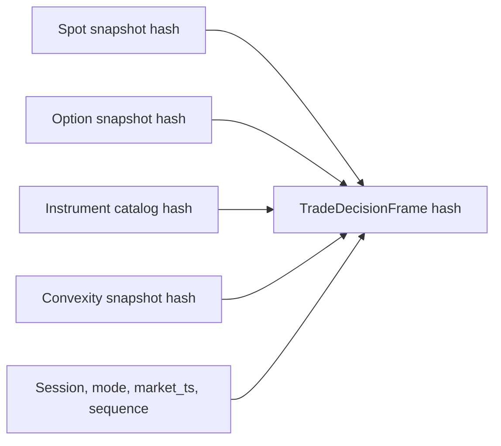
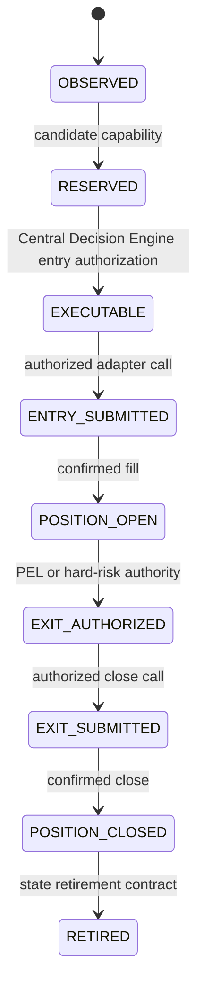

# Central Trade Authority Kernel (CTAK)

[← MTEA](MTEA.md) · [White paper](README.md) · [PEL →](PEL.md)

**Component class:** Central identity, capability, and lifecycle kernel<br>
**Reference baseline:** `zatamap-trade-api@11ad49ec`<br>
**Order authority:** Sole authenticated entry/exit authorization path

## Abstract

The Central Trade Authority Kernel formalizes the difference between evidence
and permission. CTAK represents trade decisions as immutable, hash-bound
receipts over exact identity and exchange time, and permits lifecycle
transitions only when the required capabilities are present. It prevents route
tags, log text, booleans, caches, or strategy-local functions from becoming
implicit order authority.

## 1. Security model

CTAK treats an automated trade as a capability-security problem. A component
may exercise only the capability explicitly granted by a verified receipt.
Representative capabilities are:

- observe entry evidence;
- reserve candidate;
- authorize entry;
- own position;
- authorize exit;
- confirm entry/exit execution; and
- retire position state.

The kernel assumes upstream source data can be wrong; hashes guarantee binding
and mutation detection, not market truth. Economic validity remains the job of
producers and policy authorities.

## 2. Exact trade identity

A `TradeAuthorityIdentityV1` binds the authority to the relevant dimensions of
the decision, including user, session, mode, side, exact token/symbol when
applicable, episode/trace, and market timestamp. Every consumer verifies the
identity rather than reconstructing it from an entry tag or open-position row.

## 3. Decision frame

`TradeDecisionFrameV1` captures one immutable callback ingress. Its snapshot
references are content-addressed and session-bound. Option observations enforce
positive token, consistent Call Option (CE) / Put Option (PE) symbol suffix,
finite price and strike, non-negative Volume-Weighted Average Price (VWAP),
volume, Open Interest (OI), and bounded spot synchronization.



A route can read this frame but cannot replace its market timestamp or attach a
different option snapshot later.

## 4. Receipt construction

A trade-authority receipt binds:

```text
capability
owner
exact identity
source authority class
canonical source payload
issued exchange market time
optional exchange-time validity boundary
cryptographic content hash
```

Canonical serialization makes receipt hashes deterministic. Verification
checks structure, exact identity, source binding, time validity, and hash.

## 5. Lifecycle model



An allowed transition names its required capabilities. No component can skip
states because it happens to know the entry tag or broker order ID.

## 6. Atomic exact-reservation handoff

The latest reviewed baseline makes exact reservation selection atomic. An
armed reservation cannot simultaneously supply one strike's wall identity and
another strike's Layer 3 (L3) or quote identity. The kernel separates:

- current L3 authority;
- opening-repair arbitration;
- opening-impulse tail lifecycle;
- temporal option pre-break authority;
- wall-execution lifecycle;
- sibling observation; and
- final reservation reselection.

A clean sibling may be measured through an immutable non-executable observation
receipt. Only the central reselection reducer can replace the reservation, and
it binds side, token, symbol, exchange timestamp, prior reservation, current
candidate facts, and every required sub-authority in one decision. Route-local
soft WAITs may contribute evidence but cannot replace or veto the final central
identity.

## 7. Entry authorization theorem

For a final entry request \(q\), authorization is issued only if:

\[
V(F) \land V(E) \land V(R) \land V(C)
\land I(F)=I(E)=I(R)=I(C)=I(q),
\]

where \(F\) is the decision frame, \(E\) the Market-Time Evidence Authority
(MTEA) episode ledger, \(R\) the candidate reservation, \(C\) the explicit
Central Decision Engine (CDE) verdict, \(V\) verification, and
\(I\) exact identity. Current exact-token contradiction fails closed.

The authorization expires no later than its parent reservation.

## 8. Authorized submission boundary

The runtime entry chain is:

```text
resolve_final_route_entry_cutover_v1
    -> submit_authorized_entry_v1
    -> entry_order_submission.py
    -> process_order
```

Only the central adapter may invoke provider execution for an automated entry.
Static seam registries and tests detect direct route-local calls and dormant
legacy issuers.

## 9. Exit authority

The PEL Thesis Lifecycle (PTL) produces a verified exit authorization bound to
the owned position, current Position Exit Evidence Ledger (PEL), lifecycle
transition, exact market time, and reason.
The execution adapter then records fill facts and confirmation before CTAK
permits position retirement. Hard-risk and EOD authorities remain explicit,
categorical sources; they do not spoof PEL evidence.

## 10. Fail-closed rules

| Condition | Result |
| --- | --- |
| Missing frame or receipt | No capability |
| Hash mismatch | Reject |
| User/session/mode mismatch | Reject |
| Side/token/symbol mismatch | Reject |
| Stale/future/invalid market time | Reject |
| Reservation expired | Reject |
| Sibling observed but central reselection incomplete | Observe only; no execution capability |
| CDE `approved=False` with approval-looking tag | Reject |
| Unrecognized receipt class | Reject |
| Duplicate or ambiguous exact option | Reject |
| Close unconfirmed | Position ownership remains active |

## 11. Auditability

Every capability has a version, owner, source class, exact identity, issue time,
validity boundary, reason codes, and hash. This supports causal reconstruction:
an auditor can identify not only what order occurred, but which evidence and
authority transition made it possible.

## 12. Runtime purity boundary

The `trade_authority` core is designed as a pure package: no broker, database,
network, environment, logging, process clock, or mutable global dependency.
Adapters gather external facts before calling the kernel and perform effects
only after verification.

This boundary makes deterministic unit tests possible and prevents operational
infrastructure from becoming implicit strategy policy.

## 13. Verification requirements

- deterministic canonical hash tests;
- mutation and wrong-hash rejection;
- exact identity mismatch matrices;
- stale/future/missing market-time tests;
- invalid lifecycle transition tests;
- one authorized entry and exit seam;
- direct `process_order`/close-call static scans;
- mode/session/user isolation tests;
- receipt expiry bounded by parent capability;
- atomic reservation/sibling/reselection matrices; and
- live/paper/replay contract-equivalence tests.

## 14. Scientific and security limitations

CTAK is not a formal proof of strategy correctness. Python immutability is a
programming contract, not hardware-enforced isolation, and SHA-256 binding does
not authenticate an external exchange unless source provenance is separately
secured. Operational deployment still requires least privilege, credential
isolation, tamper-evident persistence, and independent monitoring.

## Implementation map

- `trade_authority/kernel.py` — identities, receipts, capabilities, transitions
- `trade_authority/decision_frame.py` — immutable callback frame
- `trade_authority/entry/` — evidence, reservation, verdict, and entry cutover
- `trade_authority/entry/reservation_reselection.py` — atomic exact-token handoff
- `trade_authority/entry/dvr_candidate_lifecycle.py` — bound DVR candidate lifecycle
- `trade_authority/exit/` — position, exit, execution, and retirement contracts
- `trade_authority/adapters/` — effectful integration boundaries
- `tools/trade_authority_seam_registry.py` — authoritative seam inventory
