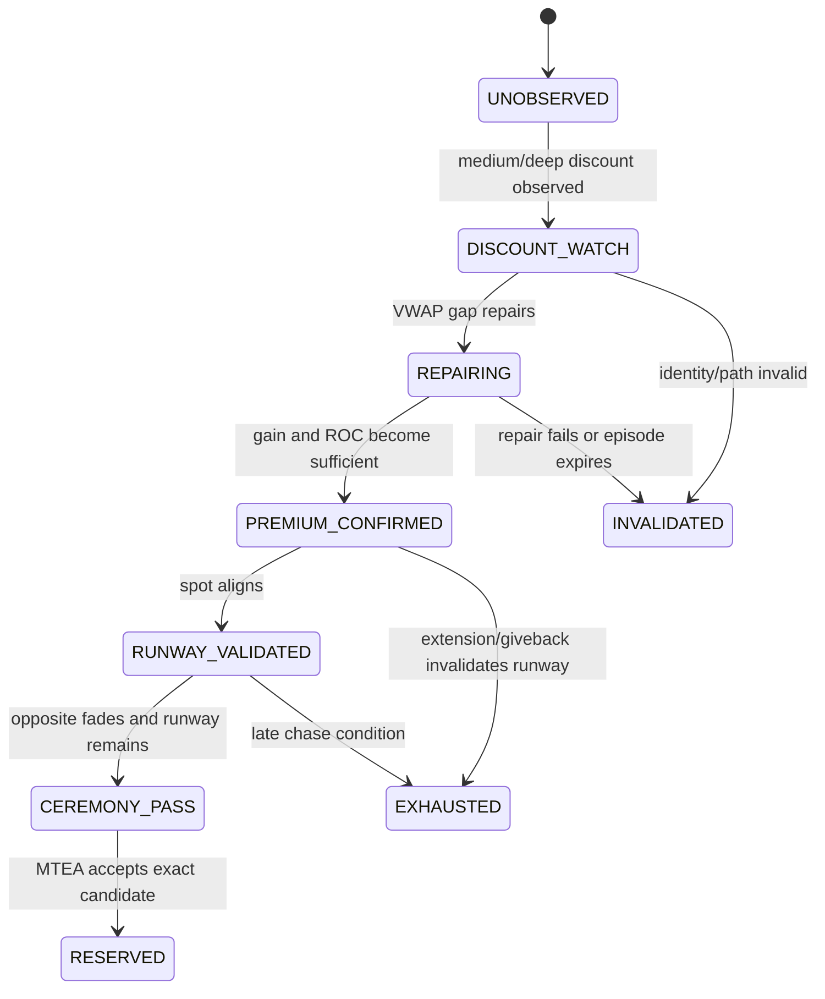
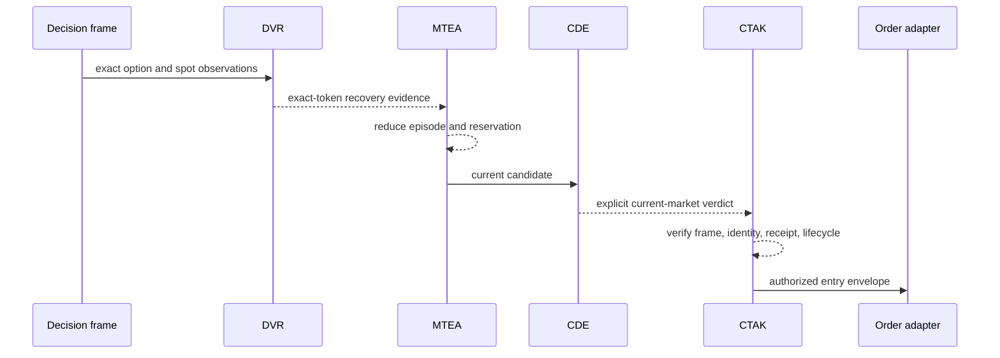

# Discounted Volume-Weighted Average Price Recovery (DVR)

[White paper](README.md) · [Momentum Ride →](MOMENTUM_RIDE.md)

**Component class:** Exact-token recovery evidence producer<br>
**Canonical source:** `DVR_RECOVERY`<br>
**Reference baseline:** `zatamap-trade-api@11ad49ec`<br>
**Order authority:** None

## Abstract

Discounted Volume-Weighted Average Price Recovery (DVR) identifies an option
contract that first trades at a material discount to its own exchange VWAP and
subsequently exhibits coherent
repair. It is designed to detect the early convex phase of a directional move,
before a conventional “premium above VWAP” continuation rule would become
eligible. DVR is neither a mean-reversion rule nor a generic cheap-option
buyer. Admission requires the premium path, discount repair, underlying
direction, opposite-side behavior, and remaining runway to agree. The detector
produces exact-token evidence; the Market-Time Evidence Authority (MTEA) owns
temporal continuity, the Central Decision Engine (CDE) owns current-market
policy, the Central Trade Authority Kernel (CTAK) owns authenticated capability
transitions, and the Position Exit Evidence Ledger (PEL) owns post-fill exit
evidence.

## 1. Objective and falsifiable thesis

For an option token \(o\), define the relative VWAP gap

\[
g_t(o)=100\frac{P_t(o)-VWAP_t(o)}{VWAP_t(o)}.
\]

DVR tests the thesis that a sufficiently negative historical gap followed by
premium appreciation and gap repair represents emerging directional demand,
provided the underlying moves in the matching direction and the opposing
option side is not expanding more strongly.

The thesis is falsified when, among other conditions:

- the contract was never materially discounted;
- the gap does not repair;
- premium recovery lacks velocity or acceleration;
- NIFTY moves against the option side;
- the opposite side remains dominant;
- the contract is already extended and the remaining entry runway is poor; or
- exact token, symbol, side, timestamp, or current quote cannot be verified.

## 2. Role boundary

DVR may:

- observe near-ATM CE and PE contracts independently;
- retain bounded exchange-time path history per token;
- calculate recovery features;
- classify a current exact-token observation; and
- publish a typed SUPPORT, WAIT, or rejection fact.

DVR may not:

- transfer evidence to a different strike;
- infer a position owner from an entry tag;
- resolve historical rejection debt;
- approve CDE policy;
- issue execution capability;
- place an order; or
- close a position.

## 3. Input contract

| Field | Scope | Requirement |
| --- | --- | --- |
| `market_ts` | Exchange | Positive, valid exchange timestamp |
| `token`, `symbol`, `side` | Exact option | Unique and mutually consistent |
| `ltp`, `vwap` | Exact option | Positive finite premium and VWAP |
| `spot` | Underlying | Fresh, exchange-time synchronized NIFTY observation |
| `strike` | Instrument | Positive strike from the active instrument universe |
| `oi`, `cum_volume` | Exact option | Optional contextual flow facts; never substitutes for price proof |
| `expiry` | Instrument | Contract date, compared with session date; no weekday constant |

The detector processes already-admitted observations. It does not repair
missing exchange time with process time.

## 4. Feature construction

For a bounded window \([t-W,t]\), DVR calculates:

| Feature | Definition |
| --- | --- |
| Minimum gap | \(g_{min}=\min g_i\) |
| Gap repair | \(R_g=g_t-g_{min}\) |
| Premium gain | \(G_p=100(P_t/P_{start}-1)\) |
| Window ROC | \(ROC_W=G_p\cdot 60/\Delta t_W\) |
| Short ROC | Same measure over the short window |
| Acceleration | \(A_p=ROC_{short}-ROC_W\) |
| Giveback | \(100(P_t/P_{peak}-1)\) |
| Spot move | \(S_t-S_{start}\) |

The baseline detector uses a 15-minute retained history, a five-minute main
window, and a one-minute short window. Baseline classification landmarks
include a medium discount at or below −6%, a deep discount at or below −10%,
at least four percentage points of gap repair, at least four percent premium
gain, and at least five NIFTY points of aligned spot movement. These are
implementation defaults, not universal market constants. Later route policy
can impose stricter basket, transfer, chase, or runway requirements.

## 5. State machine



`CEREMONY_PASS` is evidence, not permission to buy.

## 6. Side symmetry

The same directional predicate is evaluated with sign inversion:

\[
aligned(side,\Delta S)=
\begin{cases}
\Delta S \ge m, & side=CE \\
\Delta S \le -m, & side=PE.
\end{cases}
\]

Thresholds and evidence vocabulary must otherwise remain symmetric. Strike
selection must be based on instrument attributes and current proof, not on
separate CE/PE branches that embed different moneyness assumptions.

## 7. Opposite-side evidence

DVR retains the strongest fresh summary for each side. Opposite fading may be
established when the opposite premium ROC is weak, the target score leads by a
configured margin, or the target gap repair materially exceeds the opposite
repair. Absence of fresh opposite expansion is weaker evidence than an observed
fade and is treated accordingly downstream.

This comparison prevents a local rebound in one contract from being mistaken
for directional sponsorship while the opposing option side is still expanding.

## 8. Multi-strike and basket confirmation

A single option can move because of spread, quote refresh, localized liquidity,
or strike-specific IV. Basket confirmation tests whether multiple usable
same-side strikes show compatible premium recovery. It may strengthen a DVR
candidate but cannot change its exact execution identity.

The invariant is:

```text
basket proves side breadth
selected token proves executable contract
```

Evidence from sibling strikes cannot satisfy the selected token's current
quote, VWAP, liquidity, or chase checks.

## 9. Handoff and owner transfer

DVR commonly participates in three handoffs:

1. **DVR → Stable Retry:** the early recovery matures into conventional
   continuation. Stable Retry must establish its own current exact-token fact.
2. **Open-position opposite transfer:** a new side challenges the held side.
   Current exact-token, spot, old-side fade, and close-boundary evidence are all
   required.
3. **Post-close recovery:** a candidate reserved before a close may materialize
   only in a later market-time bucket under an authenticated post-close lease.

No handoff copies a prior receipt and relabels it. MTEA authenticates continuity
and CTAK authenticates the resulting capability.

## 10. CTAK exchange-time recovery episode

The short detector window answers whether the current tape is repairing. It is
not long enough to represent a recovery that develops over tens of minutes.
The latest Central Trade Authority Kernel (CTAK) baseline therefore maintains
a separate exact-token exchange-time episode keyed by application user, option
side, token, and symbol.

The reference episode requires a starting gap at or below −6%, age between 120
and 2,700 exchange-time seconds, no observation gap above 300 seconds, at least
25 aligned NIFTY points, at least 8% cumulative option gain, and at least 7.5
percentage points of VWAP-gap repair. Current detector ceremony, score, gap,
Rate of Change (ROC), acceleration, giveback, spot alignment, runway, opposite
fade, and exhaustion checks remain mandatory.

The episode receipt explicitly declares:

```text
entry_authority = false
owner_release_authority = false
current_gate_bypass = false
```

It prevents a later short-window weak-reclaim classifier from contradicting a
strictly proven episode for the same current contract. It cannot place an order,
transfer proof to a sibling strike, or weaken current Layer 2 (L2), Layer 3
(L3), Layer 4 (L4), MTEA, CDE, liquidity, expiry, quote, or risk checks.

## 11. Atomic candidate lifecycle

`DvrCandidateLifecycleV1` preserves source selection, post-preflight owner,
pre-MTEA binding, and final current route as one exact candidate lifecycle. If
an active reservation points to an older strike while a clean sibling appears,
the sibling can be observed through a non-executable receipt. Only the central
reservation-reselection reducer may atomically replace the owner after current
L3, opening repair, opening-tail, temporal pre-break, and reservation
arbitration agree.

This closes a former split in which L2/L3/L4 could evaluate one strike while a
stale reservation supplied wall or execution identity for another.

## 12. Interaction with central authorities



## 13. Failure modes and controls

| Risk | Control |
| --- | --- |
| Buying a falling “cheap” option | Require gap repair, premium gain, ROC, and aligned spot |
| Using stale recovery | Exchange-time windows and current exact snapshot |
| Cross-strike proof leakage | Exact `(side, token, symbol)` binding |
| Stale reservation displaces a clean current token | Non-executable sibling observation plus atomic central reselection |
| Opposite side still controls tape | Fresh opposite-side comparison |
| Late convexity chase | Extension, giveback, runway, and selected-token checks |
| Re-entering after close without new proof | Later-bucket MTEA recovery contract |
| Expiry calendar change | Contract expiry date, not hard-coded weekday |

## 14. Observability

Useful audit states include `discounted_recovery_watch`, `runway_validated`,
`ceremony_pass`, and `reject_exhausted_recovery`. A complete event records the
exact identity, exchange timestamp, gap path, premium path, spot movement,
opposite summary, runway flags, score, and reason codes.

Audit text is not evidence. Consumers use typed fields and verified hashes.

## 15. Verification requirements

- identical CE/PE tests under sign inversion;
- missing/invalid exchange-time rejection;
- cross-token and cross-symbol negative tests;
- minimum-discount, repair, acceleration, and exhaustion boundaries;
- opposite-freshness and basket breadth tests;
- handoff tests proving evidence is not inherited across strikes;
- short-window versus long exchange-time episode tests;
- current-L3/opening/pre-break/reselection atomicity tests;
- replay determinism under original provider-frame identity, strictly increasing
  ingestion sequence, and original in-frame packet position; and
- comparison of evidence and final authority, not merely resulting P&L.

## 16. Scientific limitations

DVR variables are correlated and path-dependent; its score is an engineering
summary, not a calibrated probability. OI may update slowly, VWAP depends on
vendor trade-volume semantics, and an apparent recovery can be caused by IV or
spread changes rather than underlying direction. Validation must report false
starts, missed recoveries, regime stratification, execution costs, and
out-of-sample performance separately.

## Implementation map

- `discounted_recovery_detector.py` — token-local feature detector
- `dvr_watch_lifecycle.py` — watch lifecycle
- `fusion_signals.py` — route integration and current policy
- `trade_authority/entry/dvr_candidate_frame.py` — typed candidate frame
- `trade_authority/entry/dvr_candidate_lifecycle.py` — exact candidate lifecycle
- `trade_authority/entry/dvr_exchange_time_recovery.py` — recovery authority
- `trade_authority/entry/reservation_reselection.py` — atomic candidate reselection
- `mtea_entry_authority.py` — central temporal handoff validation
