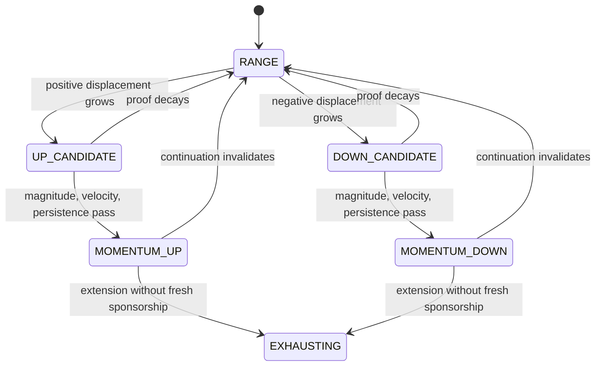
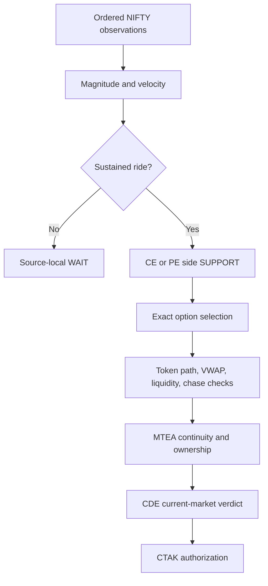

# Momentum Ride

[← DVR](DVR.md) · [White paper](README.md) · [Stable Retry →](TR_STABLE_RETRY.md)

**Component class:** Side-scoped directional continuation producer 
**Canonical source:** `MOMENTUM_RIDE` 
**Reference baseline:** `zatamap-trade-api@11ad49ec` 
**Order authority:** None

## Abstract

Momentum Ride detects a sustained, directionally coherent displacement in the
NIFTY underlying. It intentionally begins as side-scoped evidence: an upward
ride supports a Call European (CE) option and a downward ride supports a Put
European (PE) option, but the underlying alone does not identify an executable
option contract. Exact-token selection and
sponsorship are established later from option observations. This separation
prevents a strong index move from authorizing a stale, illiquid, extended, or
otherwise unsuitable option.

## 1. Objective

Momentum Ride addresses continuation after the underlying has demonstrated
both magnitude and pace. For lookback \(W\):

\[
M_t=S_t-S_{t-W}
\]

and a normalized velocity measure may be expressed as

\[
V_t=10^4\frac{S_t-S_{t-W}}{S_{t-W}}\frac{60}{\Delta t}.
\]

The baseline configuration declares a 900-second lookback, an 80-point absolute
move floor, and a three-basis-point velocity floor. The operational rolling
state transition also contains a directional threshold difference documented
below. These defaults characterize the reviewed profile; they are not claims
of statistical optimality.

## 2. Known horizon and directional asymmetry

The latest reviewed code still requires a rolling 15-minute move of at least 80
NIFTY points. A slower, longer 100–130-point trend can therefore remain `RANGE`
when no individual 15-minute window reaches that floor. Discounted Volume-
Weighted Average Price Recovery (DVR) or Stable Retry may observe such a path,
but Momentum Ride itself does not own a slow-trend episode.

The operational rolling-velocity readiness check also uses 2.0 for an upward
`MOMENTUM_UP` / Call Option (CE) move and 1.5 for a downward `MOMENTUM_DOWN` /
Put Option (PE) move. This is a real implementation asymmetry. It is not
normalized by volatility, option delta, or market regime in the current
baseline. The paper therefore does **not** characterize Momentum Ride as fully
side-symmetric. A future correction should use a common normalized rule and
must be accepted with metamorphic CE/PE tests and multi-session replay.

## 3. Producer contract

| Detector result | Side evidence |
| --- | --- |
| Sustained positive move and velocity ready | CE `SUPPORT` |
| Sustained negative move and velocity ready | PE `SUPPORT` |
| Magnitude, velocity, or persistence incomplete | Source-local `WAIT` |
| Malformed market identity/time | Reject observation |

The producer payload contains side, market timestamp, spot, detector state,
magnitude, velocity, and reason. It deliberately omits token, symbol, strike,
option premium, and option VWAP until an exact option producer supplies them.

## 4. State model

The system evaluates current evidence continuously. A completed episode may
seed temporal rejection debt or ownership constraints, but sleeping on a wall
clock is not a substitute for re-evaluation.

## 5. Exact-token materialization

A side-scoped ride becomes an entry candidate only after downstream selection
finds a contract with current proof. The selected token is evaluated for:

- symbol/side/expiry identity;
- current quote and exchange-time freshness;
- premium movement and smoothed Rate of Change (ROC);
- own-VWAP relationship and recent path;
- liquidity, cumulative volume, and spread-related quality;
- extension and giveback;
- multi-strike sponsorship when a runner-incubation path is used; and
- current L1/L2/L3/L4 and CDE policy.

The baseline selected-token path uses a 60-second lookback and normally expects
at least a 1% premium move with positive live premium ROC. Missing-data behavior
is configuration-dependent and must be reported in any experiment.

## 6. Runner incubation

Option evidence can lag a genuine underlying break. Runner incubation permits a
narrow continuation path when the parent move already satisfies the full
80-point magnitude floor and nearby strikes show broad expansion, even if some
ordinary fusion features are late.

Incubation is not a lower-quality shortcut. It adds:

- multi-strike participation;
- a minimum underlying move and velocity;
- bounded L3 total/edge floors;
- selected-token path checks;
- tail-chase protection; and
- current structural and authority verification.

An extended selected contract without digestion can still be rejected even
when basket breadth is strong.

## 7. Opening and post-failure persistence

Opening ticks have high velocity and poor path depth. A single clean tick after
a hard selected-token failure is insufficient. The reference policy remembers
recent guard failure over exchange time and requires multiple clean passes plus
a minimum hold interval before materialization. This rule is symmetric for CE
and PE.

## 8. Ownership policy

Momentum Ride detects direction independently of portfolio state. Ownership is
resolved downstream. In particular:

- an open position does not erase detector evidence;
- a detector observation cannot itself close the opposite side;
- post-loss and post-profit opposite transfers require explicit proof; and
- a source-local WAIT cannot veto DVR or Stable Retry.

The baseline restricts Momentum Ride from casually performing a post-profit
opposite flip. True reversals use stronger owner-transfer evidence through the
central temporal and position authorities.

## 9. CDE priority and admissibility

Momentum Ride is the highest-priority entry producer in the reference CDE
policy. Priority determines arbitration order, not an exemption from identity,
current-token, risk, or CTAK validation. Fresh breakout or session-extreme
evidence may qualify for narrowly specified policy treatment; it does not
become a general bypass.

## 10. End-to-end flow

## 11. Failure modes

| Failure | Control |
| --- | --- |
| Strong NIFTY move but weak option | Side evidence cannot impersonate token evidence |
| Slow drift never reaches window magnitude | Remains candidate/RANGE; DVR or Stable Retry may still observe another shape |
| CE and PE require different rolling velocity | Publish as a known open asymmetry; require normalized replacement and mirrored tests |
| One-tick opening breakout | Persistence after recent guard failure |
| Buying an extended option | Selected-token VWAP, digestion, giveback, and tail-chase guards |
| Hidden CE/PE asymmetry | Sign-inverted detector and symmetric test vectors |
| Post-profit churn | Explicit owner-transfer restriction |
| Historical boolean feeds producer | Producer emitted before MTEA and route history |

## 12. Observability

A complete evaluation should record exchange timestamp, spot anchor, elapsed
window, move points, velocity, sustained state, direction, exact candidate if
later selected, option-path disposition, CDE verdict, MTEA state, and final CTAK
authorization. This makes “no trade” attributable to a precise stage rather
than a single opaque reason string.

## 13. Verification requirements

- CE/PE sign-symmetry property tests, including the currently unequal rolling-velocity boundary;
- exact magnitude, velocity, and lookback boundaries;
- slow-drift, gap, opening-spike, and reversal scenarios;
- side evidence schema tests proving option identity is absent;
- selected-token and basket-incubation tests;
- recent-failure persistence tests using exchange time;
- post-profit owner-transfer negative tests; and
- replay comparison at producer, candidate, CDE, and authorization stages.

## 14. Scientific limitations

Fixed point thresholds are level-dependent and can behave differently across
volatility regimes. Velocity is sensitive to the observation window and gaps.
An 80-point move is not equally informative at all spot levels or times of day.
The detector should therefore be evaluated by regime, volatility, session
phase, expiry distance, and option liquidity. Classification metrics must be
reported separately from realized trade returns.

## Implementation map

- `fusion_signals.py` — detector configuration, state, token policy, and route integration
- `trade_authority/adapters/momentum_ride_entry_evidence.py` — side-evidence adapter
- `trade_authority/adapters/final_route_entry_evidence.py` — typed exact-token final-route receipt
- `trade_authority/adapters/central_entry_cutover.py` — authenticated central entry cutover
- `trade_authority/entry/entry_authorization.py` — exact MTEA-reserved CDE authorization
- `central_decision_engine.py` — current policy and priority
