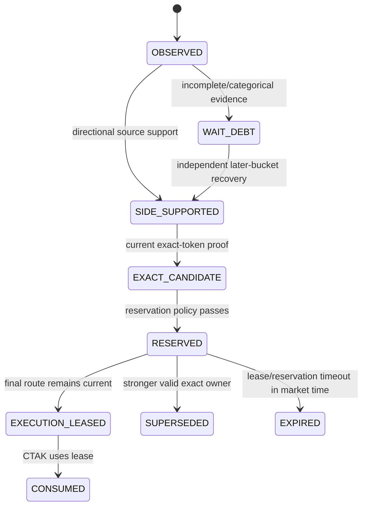
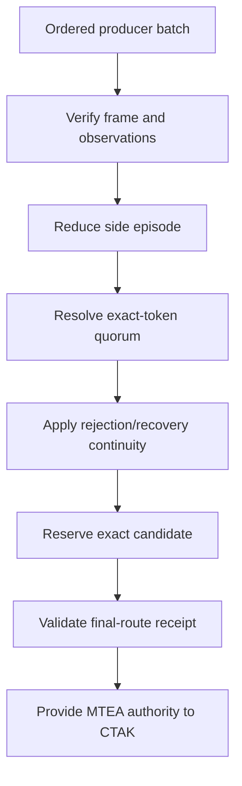

# Market-Time Evidence Authority (MTEA)

[← CDE](CDE.md) · [White paper](README.md) · [CTAK →](CTAK.md)

**Component class:** Source-neutral temporal evidence and exact-candidate authority<br>
**Reference baseline:** `zatamap-trade-api@11ad49ec`<br>
**Order authority:** None

## Abstract

The Market-Time Evidence Authority separates current signal evidence from the
history required to interpret it. MTEA reduces ordered producer observations
into exchange-time episodes, manages rejection and recovery continuity,
reserves exact candidates, authenticates owner transfers, and validates
specialized final-route receipts. It cannot approve current CDE policy or
submit an order. Its purpose is to make temporal reasoning causal,
source-neutral, and identity-preserving.

## 1. The temporal authority problem

Without a central owner, each strategy can maintain its own cache, cooldown,
reservation, and retry count. The same market episode then acquires several
incompatible histories. Worse, a route can read central history, compute a
boolean, and feed that boolean back as if it were new producer evidence.

MTEA removes that cycle by enforcing:

```text
producer fact -> ordered episode reduction -> candidate authority
```

Producer observations contain no MTEA result. MTEA state contains no fabricated
producer fact.

## 2. Identity model

An MTEA episode is bound to:

- user and trade mode;
- session date;
- direction/side;
- producer source set;
- exchange-time bucket sequence; and
- exact token/symbol when exact evidence has materialized.

The episode may combine independent side support across sources. Exact-token
authority requires exact-token observations; side quorum alone is insufficient.

## 3. Market-time buckets

Let \(b(t)\) be the configured exchange-time bucket. For ordered observations
\(o_i\), continuity is reduced as

\[
L_i = R(L_{i-1}, o_i, b(t_i)), \quad t_i \ge t_{i-1}.
\]

Multiple observations in the same bucket can enrich the current snapshot but
cannot masquerade as independent temporal persistence. Recovery from a
categorical WAIT normally requires support in a later bucket.

The reducer rejects future-dated, backward, stale, or missing market time. It
does not compare the replay timestamp with today's wall clock.

The reference central-continuity profile retains a bounded 120-second evidence
window, uses fixed ten-second exchange-time buckets, requires three independent
side-support buckets and three independent exact-token support buckets, and
still requires one current exact-token requalification. These values describe
the pinned implementation profile; sensitivity to them must be tested rather
than assumed.

## 4. Episode lifecycle



MTEA's `EXECUTION_LEASED` state is a temporal/candidate capability; it is not
CTAK `ENTRY_AUTHORIZATION`.

## 5. Producer normalization

Canonical producer sources include:

| Route label | MTEA source |
| --- | --- |
| DVR route | `DVR_RECOVERY` |
| Momentum route | `MOMENTUM_RIDE` |
| Stable Retry variants | `STABLE_RETRY` |

Tags used for exit policy do not create separate MTEA producers.

## 6. Directional episode authority

`MTEA_DIRECTIONAL_EPISODE_AUTHORITY_V1` evaluates:

- valid side and candidate identity;
- current underlying support and non-contradiction;
- source diversity and support bucket count;
- exact-token support and current confirmation;
- categorical rejection debt;
- same-token discounted-continuity recovery;
- cross-route exact-token quorum; and
- rotating-token materialization constraints.

The authority explains which checks passed and retains counts for audit. Its
`active` flag is true only when the required semantic profile is satisfied.

## 7. Final-route receipt profiles

MTEA recognizes explicit receipt classes. Examples include:

- `DVR_FINAL_ROUTE_V1` — current route packet, authoritative preflight, exact
  signal/execution identity, and CDE approval;
- `STABLE_RETRY_WALL_ROUTE_V1` — current execution route, wall handoff class,
  all wall checks, exact identity, same market tick, CDE approval, and no
  pre-order veto; and
- `FINAL_SUPPORT_ROUTE_V1` — current observation support, current tick, exact
  identity, complete final contract, CDE approval, and no veto.

MTEA validates the required check names as well as their truth values. This
prevents an arbitrary receipt from declaring different fields true and being
treated as equivalent proof.

## 8. Owner transfer

An opposite-side candidate cannot silently inherit the current position's
authority. MTEA requires a typed transfer that can include:

- current exact-token and probe confirmation;
- current underlying same-side, same-tick support;
- absence of unresolved current-token WAIT;
- distinction between sibling-token and current-token debt;
- authenticated close boundary and close outcome;
- prior reservation timing;
- later-bucket materialization; and
- no conflicting opposite reservation.

Post-close recovery is a state transition, not a timer-based exception.

## 9. Same-token recovery

When the exact same contract recovers from an earlier discounted WAIT, MTEA can
authenticate that continuity without demanding a redundant additional
callback. The recovery remains conditional on current L2/L3/L4 proof, current
token identity, non-contradictory underlying, and the exact recovered history.

This exception reduces artificial latency while preserving causality; it does
not permit sibling-strike substitution.

## 10. Active reservation and atomic reselection

The latest baseline separates observing a sibling candidate from changing the
reserved execution identity. An active reservation may expose a different clean
current contract through `CTAK_RESERVATION_SIBLING_OBSERVATION_AUTHORITY_V1`, but that
receipt is explicitly non-executable. Central Trade Authority Kernel (CTAK)
reservation arbitration evaluates the current Layer 3 (L3) authority, opening
repair, opening-tail lifecycle, temporal pre-break, categorical debt, and exact
market identity before an atomic reselection can occur.

The resulting active reservation selection is one side/token/symbol/timestamp
decision. Route-local soft waits can be recorded; they cannot silently replace
or veto that identity. This prevents support/resistance walls from being
calculated for one strike while execution remains pinned to another.

## 11. Typed wall-break continuation

`CTAK_MTEA_WALL_BREAK_CONTINUATION_RECEIPT_V1` carries the exact wall class, break/hold
evidence, current candidate identity, and exchange timestamp. The consumer
validates the named semantic profile rather than treating arbitrary true fields
as equivalent. A wall lease can materialize only while the same exact candidate
and current market tick remain authoritative.

## 12. Authority composition



## 13. Failure modes

| Failure | Control |
| --- | --- |
| Strategy-specific histories diverge | Source-neutral central episode |
| Same tick counted as persistence | Unique exchange-time bucket |
| Side proof converted to token proof | Separate evidence scopes |
| Sibling-strike WAIT blocks selected token | Current-token and sibling debt tracked separately |
| Arbitrary all-true receipt | Recognized semantic receipt profiles |
| Post-close candidate executes immediately | Close boundary plus later-bucket lease |
| Replay uses process time | Market timestamp is mandatory and authoritative |
| Active reservation hides clean sibling evidence | Non-executable sibling observation and central atomic reselection |
| Wall proof and execution token diverge | Exact MTEA wall-break receipt at the same market tick |

## 14. Observability

MTEA events should expose episode ID, exact identity, market bucket, producer
sources, current dispositions, unique support/wait counts, categorical debt,
reservation state, lease state, transfer state, receipt profile, missing/failed
required checks, and authority hash.

## 15. Verification requirements

- call-order independence for a producer batch;
- monotonic market-time and later-bucket recovery tests;
- side/exact evidence separation;
- source-local WAIT non-interference;
- current-token versus sibling-token debt tests;
- receipt-profile missing/renamed/false check negatives;
- sibling observation, reservation arbitration, and atomic reselection tests;
- exact wall-break receipt and wall-lifecycle tests;
- reservation expiry, supersession, close-boundary, and post-close recovery;
- cross-mode/session/user identity negatives; and
- deterministic replay of complete episode ledgers.

## 16. Scientific limitations

Temporal buckets discretize a continuous market process and can create boundary
effects. Source diversity is not statistical independence when producers share
features. MTEA therefore establishes software authority, not probabilistic
confidence. Empirical work should test sensitivity to bucket width, source
correlation, observation loss, and delayed/asynchronous option updates.

## Implementation map

- `mtea_entry_authority.py` — semantic authority builders and validators
- `trade_authority/entry/episode_reducer.py` — central exchange-time episode ledger
- `trade_authority/entry/candidate_reservation.py` — exact reservation contract
- `trade_authority/entry/evidence.py` — producer observation and evidence scopes
- `trade_authority/entry/accepted_lifecycle.py` — post-fill owner and evidence commit
- `trade_authority/entry/mtea_wall_break_receipt.py` — exact wall continuation
- `trade_authority/entry/reservation_reselection.py` — atomic reservation arbitration
- `stable_retry_evidence_cache.py` — legacy migration surface
