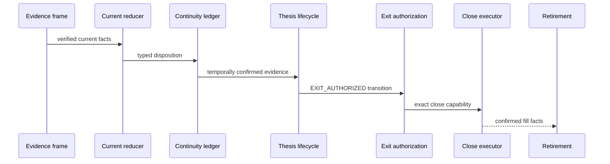

# Position Exit Evidence Ledger (PEL)

[← CTAK](CTAK.md) · [White paper](README.md) · [PTL →](PTL.md)

**Component class:** Current and cross-tick position-exit evidence authority 
**Reference baseline:** `zatamap-trade-api@11ad49ec` 
**Order authority:** None; the PEL Thesis Lifecycle consumes PEL evidence

## Abstract

The Position Exit Evidence Ledger governs evidence about a position after
entry. It converts an authenticated current market frame into a deterministic
assessment and reduces that assessment through exchange-time continuity. PEL
does not advance the executable position state or issue a close. The
[PEL Thesis Lifecycle (PTL)](PTL.md) consumes the ledger and owns the thesis
transition and ordinary discretionary exit authorization.

## 1. Objective

An entry proves only that opening the position was authorized at \(t_0\). It
does not prove that the thesis remains valid at \(t>t_0\). PEL asks:

> Given the exact held contract, its entry geometry, current premium/Volume-
> Weighted Average Price (VWAP) path, profit state, directional context, and
> independent market-time continuity, what evidence supports maintaining,
> protecting, transferring, or releasing ownership?

## 2. Owned-position identity

`PelOwnedPositionThesisV1` binds:

- user, session, and trade mode;
- entry episode and parent order;
- side, exact token, and symbol;
- entry exchange time and price;
- entry authority provenance; and
- current position ownership hash.

Every PEL frame and transition must match this identity. A nearby contract or
new strategy tag cannot manage the position by analogy.

## 3. Evidence frame

`PelEvidenceFrameV1` composes verified current sources:

| Source | Question |
| --- | --- |
| Exact-token market path | Is premium rising/falling, above/below own VWAP, improving/deteriorating, or giving back? |
| Entry-origin wall geometry | Has the structural origin that justified entry held or broken? |
| Profit lifecycle | Is the position profitable, has a floor been earned, and has it been breached? |
| Option market-flow context | What do current volume, Open Interest (OI), and related option-flow facts indicate? |
| Directional/owner evidence | Does underlying direction support the current owner or a corroborated opposite transfer? |
| Central Decision Engine (CDE) / Trailing Stop-Loss (TSL) guidance | Should protection be wide, normal, tightened, or urgent? |

All sources are current, exact-identity, exchange-time bound, and independently
verifiable.

## 4. Current evidence reducer

PEL classifies one authenticated frame into:

| Disposition | Meaning |
| --- | --- |
| `HOLD_SUPPORT` | Current evidence supports continued ownership |
| `WAIT` | Evidence is incomplete or mixed; no categorical exit yet |
| `PROFIT_LOCK` | Earned profit protection is active |
| `LOSS_INVALIDATION` | Entry thesis is invalidated under loss policy |
| `CORROBORATED_REVERSAL` | Current position is opposed by verified directional evidence |

This is a single-tick assessment, not a close capability.

## 5. Continuity ledger

`PelEvidenceContinuityLedgerV1` stores unique exchange-time buckets and evaluates
consecutive support, reversal, loss, and profit-lock episodes. It prevents a
burst of callbacks within one timestamp from being counted as temporal
confirmation.

Current evidence can recover a pending reversal only through a later-bucket
transition. Missing evidence ordinarily yields WAIT; it does not silently
become adverse proof.

## 6. PEL-to-PTL handoff

PEL hands PTL a verified current assessment and its bound continuity ledger.
Both carry the same user, session, mode, episode, parent order, side, token,
symbol, exchange market timestamp, and source hashes. PTL refuses a ledger that
is stale, identity-mismatched, semantically inconsistent, or detached from the
current assessment. The state machine and close capability are documented in
[PEL Thesis Lifecycle](PTL.md).

## 7. Profit lifecycle

PEL distinguishes current Profit and Loss (P&L) from an earned profit floor. A mature floor breach
can justify an exact-path exit without waiting for a broad directional reversal,
provided the profit lifecycle, token path, and authority identity are verified.
This prevents a profitable runner from surrendering an earned floor solely
because slow aggregate indicators still appear favorable.

Conversely, a transient premium dip before the position earns that protection
does not automatically become `PROFIT_LOCK`.

## 8. Volume and open interest

Volume and OI are context, not standalone causal conclusions. For a long option
position, premium rising while OI falls can be consistent with short covering;
premium rising with OI rising can be consistent with long build-up. Those
interpretations are hypotheses because OI updates can be delayed and aggregate
many participants.

PEL therefore combines signs and paths rather than imposing a universal
correlation:

| Premium | OI | Plausible interpretation | Authority implication |
| --- | --- | --- | --- |
| Rising | Rising | Long build-up / expanding participation | Supports only with path and direction agreement |
| Rising | Falling | Short covering / rapid unwind | May support momentum but can exhaust quickly |
| Falling | Rising | New opposing writing or failed demand | Adverse only with corroboration |
| Falling | Falling | Long unwinding / participation decay | Adverse only with continuity |

No row alone authorizes a close.

## 9. Owner transfer

PEL separates same-side continuity from opposite transfer. An opposite-side
producer can challenge the current owner, but transfer requires exact current
evidence, directional corroboration, authenticated close boundary, and a later
entry authority. The new side cannot become owner merely because the old side
was closed.

## 10. Downstream authorization and execution

PTL builds `PelExitAuthorizationV2` only after authenticating the PEL evidence
ledger and lifecycle transition. `CloseExecutionOutcomeV1` interprets provider
results. A position retirement contract is created only after the close is
confirmed.

## 11. Hard-risk separation

Broker/account risk, catastrophic stop, unavailable margin, and end-of-day
liquidation are categorical operational authorities. They remain separate from
PEL/PTL discretionary evidence process and must be named in the close provenance.
This preserves auditability: a risk liquidation is not misreported as a market
thesis reversal.

## 12. Failure modes

| Failure | Control |
| --- | --- |
| Single adverse tick closes runner | Exchange-time continuity ledger |
| Stale sibling token manages position | Exact held-token identity |
| Entry tag determines exit by substring | Verified entry provenance and explicit risk policy |
| OI correlation treated as causal rule | Multi-source contextual frame |
| PEL evidence treated as a close command | PTL state and V2 exit capability are separately required |
| Exit state assumed filled | Separate execution facts and confirmation |
| Live initialization race | Canonical lifecycle recorded before monitor ownership |
| Duplicate callbacks count as persistence | Unique market buckets |

## 13. Observability

For every position, record the owned identity, current premium/VWAP/OI/volume
path, profit/floor state, geometry, current assessment, continuity counts,
the downstream PTL state/reason, CDE guidance, exit authorization, provider
outcome, and retirement status. `trail_data` supports high-resolution path
inspection; `trail_summary_day` supports authoritative best/worst summaries.

## 14. Verification requirements

- exact held-token and wrong-token negatives;
- current assessment classification tables;
- unique-bucket continuity and recovery;
- PEL-to-PTL identity and source binding;
- mature floor exact-path exits;
- same-side continuity and opposite transfer;
- malformed/stale flow context;
- close partial/failure/success outcomes;
- PEL evidence alone cannot authorize a close;
- no retirement before confirmation; and
- parity comparisons between legacy and PEL outcomes during migration.

## 15. Scientific limitations

Exit quality is subject to censoring: the realized close prevents observation of
the counterfactual later path under continued holding. Best/worst excursion is
descriptive and can introduce hindsight if used to tune online decisions.
Research should report maximum favorable/adverse excursion, exit delay,
post-exit path, transaction costs, and policy ablations on a holdout cohort.
Correlations among LTP, VWAP, OI, and volume require lag-aware analysis and do
not establish causality.

## Implementation map

- `trade_authority/exit/position_context.py` — owned thesis and market context
- `trade_authority/exit/token_path.py` — exact-token premium/VWAP path
- `trade_authority/exit/flow_context.py` — volume/OI context
- `trade_authority/exit/reducer.py` — current evidence classification
- `trade_authority/exit/continuity.py` — exchange-time ledger
- `trade_authority/exit/thesis_lifecycle.py` — downstream PTL state transitions
- `trade_authority/exit/authorization.py` — downstream PTL exit capability
- `trade_authority/exit/execution.py` — provider fill and close confirmation
- `trade_authority/exit/retirement.py` — terminal ownership retirement
