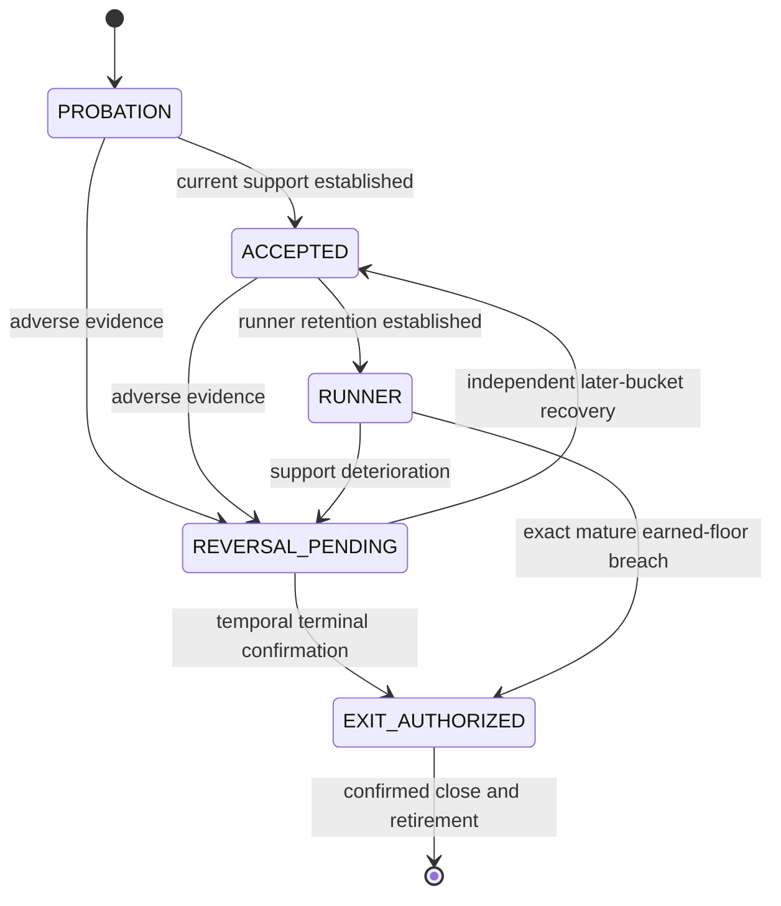
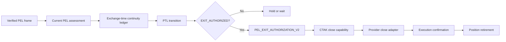

# PEL Thesis Lifecycle (PTL)

[← PEL](PEL.md) · [White paper](README.md)

**Full name:** Position Exit Evidence Ledger Thesis Lifecycle<br>
**Canonical shorthand:** PEL Thesis Lifecycle (PTL)<br>
**Component class:** Owned-position state and ordinary discretionary exit authority<br>
**Reference baseline:** `zatamap-trade-api@11ad49ec`<br>
**Order authority:** May issue a typed close capability; provider execution is separate

## Abstract

The PEL Thesis Lifecycle converts verified Position Exit Evidence Ledger (PEL)
facts into an explicit state for the exact owned option position. PTL separates
an adverse observation from a temporally confirmed exit thesis, and separates
the exit thesis from execution. At the reviewed development baseline, PTL is
the sole ordinary discretionary SELL authority for a centrally owned position.
Categorical hard-risk, end-of-day, manual, and reconciliation exits remain
explicit independent authorities.

## 1. Objective

PEL answers “what does current and persistent evidence say?” PTL answers:

> Given verified PEL evidence for the exact owned position, which thesis state
> is causally justified, and has that state earned discretionary exit
> authorization?

This split prevents three invalid implications:

```text
one adverse tick            != confirmed exit
legacy close proposal       != exit authority
EXIT_AUTHORIZED state       != confirmed provider fill
```

## 2. Input contract

PTL consumes:

- `PelOwnedPositionThesisV1` exact ownership identity;
- `PelEvidenceAssessmentV1` current PEL disposition;
- `PelEvidenceContinuityLedgerV1` unique exchange-time history;
- `PelOptionMarketFlowContextV1` when complete and current;
- profit-floor and exact-token path facts; and
- a prior `PelThesisLifecycleTransitionV1`, if the episode already exists.

Every source must agree on user, session date, trade mode, episode, parent
order, side, token, symbol, market bucket, and source hashes. Missing or
cross-position data fails closed.

## 3. Lifecycle states

| State | Meaning |
| --- | --- |
| `PROBATION` | Position is open but ongoing sponsorship is not yet established |
| `ACCEPTED` | Current and persistent evidence supports the entry thesis |
| `RUNNER` | The position has earned runner-retention treatment |
| `REVERSAL_PENDING` | Current adverse evidence exists but lacks terminal confirmation |
| `EXIT_AUTHORIZED` | A verified terminal PTL condition has been reached |



The transition is immutable and hash-bound to its prior state and PEL sources.

## 4. Transition semantics

Representative transition reasons include:

- `POSITION_OPENED_PENDING_SPONSORSHIP`;
- `CURRENT_SUPPORT_ESTABLISHED`;
- `CURRENT_SUPPORT_CONTINUES`;
- `RUNNER_RETENTION_ESTABLISHED`;
- `CURRENT_EVIDENCE_INCOMPLETE`;
- `REVERSAL_AWAITING_CONTINUITY`;
- `RECOVERY_AWAITING_NEW_BUCKET`;
- `REVERSAL_RECOVERED`;
- `EXACT_EARNED_FLOOR_EXIT`; and
- `TEMPORALLY_CONFIRMED_EXIT`.

Reason codes describe the transition. They are not parsed to create it.

## 5. Current versus temporal evidence

A PEL `LOSS_INVALIDATION`, `CORROBORATED_REVERSAL`, or `PROFIT_LOCK` is a
current classification. PTL ordinarily requires the corresponding continuity
ledger state before becoming terminal. A new bucket is defined by exchange
time, not callback count or process time.

An exact mature earned-floor breach is a deliberately narrow exception: it can
authorize an exit from verified exact-token and profit-lifecycle facts without
waiting for a broad reversal, because the protection was earned by the held
position itself.

## 6. Direction precedence correction in the latest baseline

The latest reviewed `development` baseline closes a material directional gap.
An absent same-side owner is not evidence that the opposite direction controls
the market. For ordinary PTL loss invalidation, all current directional facts
must agree before adverse buckets can accumulate:

1. actionable, high-conviction opposite Layer 2 (L2) option evidence;
2. current raw index trend opposite the held option side; and
3. current latched index trend opposite the held option side.

For a held Call Option (CE), both raw and latched index direction must therefore
be bearish; for a held Put Option (PE), both must be bullish. L2 disagreement
alone remains `WAIT` rather than manufacturing a direction from missing
ownership.

This rule does not weaken hard stops, structural risk, mature earned-profit
exits, or authenticated atomic owner transfers.

## 7. Sole ordinary discretionary exit authority

At the current boundary, route-local exit proposals, legacy position-evidence
authority, direct momentum closes, dynamic-wall closes, and compatibility
parity reducers cannot independently sell a centrally owned position. The
ordinary path is:



The historical name `PEL_EXIT_AUTHORIZATION_V2` is retained in code; its
terminal lifecycle source is canonical PTL.

## 8. Exit capability binding

The V2 authorization binds:

- PTL state `EXIT_AUTHORIZED`;
- current and temporally confirmed PEL dispositions;
- exact held identity and parent order;
- PTL transition ID and hash;
- PEL assessment and ledger IDs/hashes;
- one current exchange timestamp; and
- an execution tag consistent with the authenticated terminal disposition.

A ledger without PTL, a stale transition, a sibling-token transition, or a
tag-only proposal cannot authorize SELL.

## 9. Execution and retirement

PTL authorizes intent; it does not claim a fill. The close adapter records
provider-neutral fill facts and interprets success, partial completion, or
failure. Position ownership is retired only after a verified close execution
confirmation. Until then, the exact thesis remains owned and cannot be treated
as flat merely because a close was attempted.

## 10. Categorical exits

The following remain outside ordinary PTL discretion:

- capital-safety or catastrophic hard risk;
- end-of-day liquidation;
- explicit manual intervention;
- broker/database reconciliation safety; and
- replay boundary closure.

Each uses a named authority and provenance. A categorical exit is not reported
as a PTL reversal.

## 11. Failure modes

| Failure | Control |
| --- | --- |
| Opposite L2 alone closes an otherwise supported runner | Require raw and latched index direction agreement |
| Missing owner interpreted as bearish/bullish evidence | Owner absence has no directional sign |
| Repeated callbacks manufacture continuity | Unique exchange-time PEL buckets |
| Old position transition closes new position | Exact episode, parent, token, symbol, and hash binding |
| Legacy proposal bypasses PTL | Sole V2 ordinary authorization seam |
| `EXIT_AUTHORIZED` assumed filled | Separate execution confirmation and retirement |
| Tag substring selects exit policy | Typed transition and disposition own semantics |

## 12. Observability

A PTL audit record should expose the exact position identity, prior/current
state, state-entered exchange time and bucket, current and confirmed PEL
dispositions, transition reason, source frame/assessment/ledger hashes,
flow-context availability, authorization ID/hash, provider outcome, and
retirement status.

## 13. Verification requirements

- legal and illegal lifecycle-transition matrices;
- later-bucket recovery from `REVERSAL_PENDING`;
- exact mature earned-floor path;
- wrong user/session/mode/parent/token/symbol negatives;
- L2-only, raw-only, latched-only, and all-three directional matrices;
- mirrored CE/PE direction tests;
- sole ordinary SELL seam static tests;
- categorical exit separation;
- close failure/partial/success and no-premature-retirement tests; and
- NATS replay parity for the exact PEL/PTL transition ledger.

## 14. Scientific limitations

PTL is a deterministic expert-policy state machine, not a calibrated survival
model. Its observations are correlated, and the exit itself censors the future
counterfactual path. Evaluation should report state occupancy, transition
frequency, false terminal transitions, recovery after `REVERSAL_PENDING`,
Maximum Favorable Excursion, Maximum Adverse Excursion, and post-exit path on
untouched cohorts. Directional agreement improves causal consistency but does
not prove economic optimality.

## Implementation map

- `trade_authority/exit/thesis_lifecycle.py` — PTL states and transition reducer
- `trade_authority/exit/authorization.py` — V2 terminal exit capability
- `trade_authority/exit/reducer.py` — current PEL assessment and direction precedence
- `trade_authority/exit/continuity.py` — market-time confirmation ledger
- `trade_authority/adapters/pel_thesis_lifecycle.py` — runtime PTL adapter
- `trade_authority/adapters/exit_execution.py` — close execution boundary
- `trade_authority/exit/execution.py` — fill and confirmation contracts
- `trade_authority/exit/retirement.py` — terminal ownership retirement
