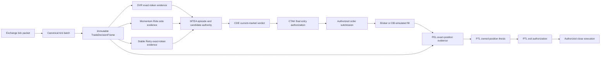
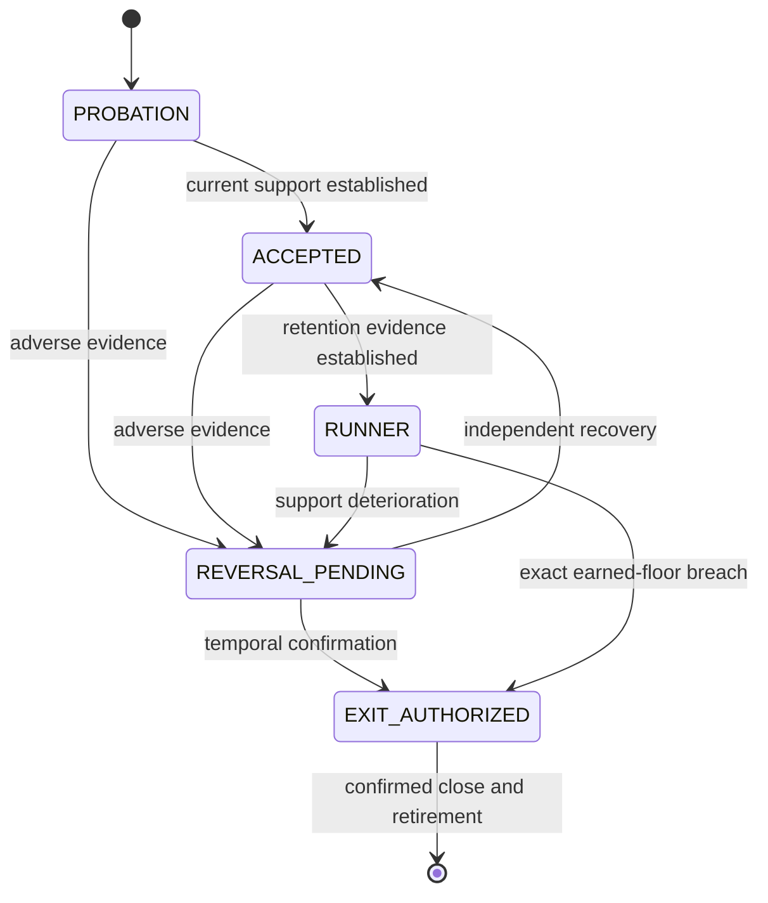

# A Causal, Exchange-Time Architecture for Directional Index-Option Trading

## Strategy production, temporal evidence, centralized authorization, and position lifecycle control

**Document class:** Technical white paper and reference architecture<br>
**Publication status:** Engineering preprint<br>
**Reference implementation:** latest reviewed `development` at `11ad49ec87362aa066afa76997cb3506b28bf076`<br>
**Revision:** 1.1 — 19 August 2026<br>
**Scope:** NIFTY directional option buying in live, paper, and historical-replay modes

[Project High-Level Design](../architecture/ZATAMAP_HIGH_LEVEL_DESIGN.md)

> This paper describes a software decision architecture. It is not investment
> advice, a claim of profitability, or evidence that historical performance will
> generalize to future market regimes.

## Abstract

Directional index-option trading is not reducible to a fixed conversion from
underlying movement to option return. The option premium is a nonlinear,
state-dependent response to the underlying path, delta, gamma, implied
volatility, theta, moneyness, market depth, and time to expiry. This creates a
systems problem as much as a signal problem: several valid detectors may
observe different aspects of the same market episode, yet no detector should be
able to manufacture temporal continuity, select an unrelated contract, inherit
stale evidence, or submit an order independently.

This paper presents Zatamap's reference architecture for separating those
responsibilities. Three entry producers—Discounted Volume-Weighted Average
Price Recovery (DVR), Momentum Ride, and Trend-Reversal (TR) Stable Retry—
generate bounded evidence. The
Central Decision Engine (CDE) evaluates market and structural admissibility.
The Market-Time Evidence Authority (MTEA) owns evidence continuity, exact-candidate
identity, and transfer history. The Central Trade Authority Kernel (CTAK)
authenticates immutable decision frames and capability transitions. The
Position Exit Evidence Ledger (PEL) owns cross-tick exit evidence, while the
PEL Thesis Lifecycle (PTL) governs an opened position's thesis and exit
authorization. The architecture uses exchange time as the sole strategy clock
and binds evidence to side, token, symbol, session, mode, and source hashes.

The result is a causal decision pipeline intended to produce the same strategy
interpretation when the same ordered exchange observations are supplied in
live, paper, or replay operation. Transport, persistence, and broker simulation
may differ; market semantics must not.

## 1. Research question

The engineering question is:

> How can several directional option-entry methods share market observations
> and historical context without creating duplicate, circular, stale, or
> mode-dependent authority?

The design follows four hypotheses.

1. Signal production and trade authorization are distinct capabilities.
2. Temporal evidence is valid only when ordered by exchange time and bound to
   an exact market identity.
3. Side-scoped evidence and exact-token evidence must remain distinguishable.
4. Live, paper, and replay parity is primarily a data-lineage and clock
   invariant, not merely a common-code aspiration.

## 2. Contributions

The reference architecture contributes:

- a typed taxonomy separating evidence producers, policy evaluators, temporal
  authorities, execution authorities, and position-lifecycle authorities;
- a common immutable decision frame for underlying and option observations;
- source-neutral temporal reduction without transferring proof across tokens;
- hash-bound capability receipts and explicit lifecycle transitions;
- exchange-time-only strategy semantics across live, paper, and backtest;
- fail-closed handling of missing time, ambiguous identity, stale evidence, and
  incomplete authority; and
- a reproducibility contract that distinguishes deterministic decision parity
  from broker-fill and infrastructure parity.

### 2.1 Implementation-review method

This revision was derived from a clean, detached review of commit
`11ad49ec87362aa066afa76997cb3506b28bf076`, fetched from the latest
`development` branch on 19 August 2026. The review traced each producer from
feature construction through its typed adapter, exchange-time reducer,
candidate reservation, Central Decision Engine verdict, Central Trade
Authority Kernel cutover, submission seam, Position Exit Evidence Ledger, and
PEL Thesis Lifecycle. Claims were cross-checked against contract definitions,
runtime call sites, seam-registry declarations, and positive and negative
tests. A targeted architecture suite completed with 308 tests and 271 subtests
passing. This establishes consistency with the pinned implementation; it does
not establish economic efficacy.

## 3. Terminology and system taxonomy

| Component | Class | Primary question | May submit an order? |
| --- | --- | --- | --- |
| [Discounted Volume-Weighted Average Price Recovery (DVR)](DVR.md) | Exact-token recovery producer | Is a previously discounted option repairing with usable runway? | No |
| [Momentum Ride](MOMENTUM_RIDE.md) | Side-scoped continuation producer | Is the underlying sustaining a sufficiently large directional move? | No |
| [Trend-Reversal (TR) Stable Retry](TR_STABLE_RETRY.md) | Exact-token continuation/re-entry producer | Has a trend-aligned candidate earned a safe retry after prior uncertainty? | No |
| [Central Decision Engine (CDE)](CDE.md) | Current-market policy evaluator | Is the proposed direction admissible under current state, structure, session, and Layer 2 evidence? | No |
| [Market-Time Evidence Authority (MTEA)](MTEA.md) | Temporal evidence and candidate authority | Does current evidence belong to a valid episode and exact candidate? | No |
| [Central Trade Authority Kernel (CTAK)](CTAK.md) | Central capability and lifecycle kernel | Are identity, provenance, authority, and state transition valid? | Only through its authorized submission boundary |
| [Position Exit Evidence Ledger (PEL)](PEL.md) | Cross-tick position-exit evidence ledger | What current and persistent evidence describes the exact held position? | No |
| [PEL Thesis Lifecycle (PTL)](PTL.md) | Owned-position state and discretionary exit authority | Does the owned thesis remain supported, require protection, or justify exit? | It can authorize a close; execution remains separate |

`TR_STABLE_RETRY`, `TR_STABLE_RETRY_R`, and
`TR_STABLE_RETRY_BASKET` are variants of one Stable Retry family. They encode
different admission proof and subsequent lifecycle policy; they are not three
independent strategies.

### Acronym glossary

| Term | Full form / meaning |
| --- | --- |
| CE | Call European, the exchange option-type code for a call option |
| CDE | Central Decision Engine |
| CTAK | Central Trade Authority Kernel |
| DVR | Discounted Volume-Weighted Average Price Recovery |
| IV | Implied Volatility |
| L1–L4 | Layer 1 underlying direction; Layer 2 directional participation; Layer 3 option quality; Layer 4 structure/location |
| LTP | Last Traded Price |
| MAE | Maximum Adverse Excursion |
| MFE | Maximum Favorable Excursion |
| MTEA | Market-Time Evidence Authority |
| OI | Open Interest |
| PE | Put European, the exchange option-type code for a put option |
| PEL | Position Exit Evidence Ledger |
| PTL | PEL Thesis Lifecycle |
| ROC | Rate of Change |
| TR | Trend Reversal |
| TSL | Trailing Stop-Loss |
| VWAP | Volume-Weighted Average Price |

## 4. Market model

Let \(S_t\) denote the NIFTY spot level and \(P_t\) the premium of a selected
put or call. For a sufficiently small interval, a second-order approximation is

\[
\Delta P \approx \Delta\,\Delta S
  + \tfrac{1}{2}\Gamma(\Delta S)^2
  + \mathcal{V}\,\Delta\sigma
  + \Theta\,\Delta t
  + \varepsilon,
\]

where \(\Delta\), \(\Gamma\), \(\mathcal{V}\), and \(\Theta\) represent delta,
gamma, vega, and theta, while \(\varepsilon\) includes spread, depth,
asynchronous updates, and microstructure effects. For a put, delta is generally
negative, so spot and premium levels may display a strong inverse relationship.
That relationship is neither a fixed ratio nor stable at tick resolution.
This local sensitivity decomposition is an engineering approximation grounded
in the standard option-pricing framework introduced by Black and Scholes [1];
it is not a claim that observed ticks satisfy that model exactly.

The exchange VWAP of the option is its own traded-premium statistic:

\[
\operatorname{VWAP}_t =
\frac{\sum_{i \le t} p_i q_i}{\sum_{i \le t}q_i}.
\]

It is not NIFTY VWAP translated into option units. DVR and Stable Retry therefore
reason about the selected contract's premium path relative to its own VWAP,
while Momentum Ride begins with the underlying and obtains exact-token proof
later.

## 5. End-to-end authority architecture



The diagram is logical rather than an assertion that every legacy function is
physically isolated. The reference baseline has completed major CTAK cutovers,
but some route-local calculations remain in a large orchestration module. The
authority contract—not file placement—is the normative boundary.

## 6. Immutable decision frame

Each evaluation callback is represented by a `TradeDecisionFrameV1`. Its
identity includes:

- user, session date, and trade mode;
- exchange market timestamp and callback sequence;
- current spot;
- zero or more exact option observations;
- token, symbol, side, strike, premium, option VWAP, cumulative volume, and OI;
- signed references to spot, option, instrument-catalog, and optional convexity
  snapshots; and
- a deterministic content hash.

An exact option lookup succeeds only if precisely one observation matches
`(side, token, symbol)`. The frame also limits spot/option synchronization age
to two exchange-time seconds. Missing or ambiguous identity does not fall back
to a nearby strike, a cached sibling, or a wall-clock timestamp.

## 7. The exchange-time axiom

For every market-dependent state transition, the strategy clock is

\[
t_{strategy} := t_{exchange}.
\]

The following values are explicitly not strategy time:

- NATS receive time;
- NATS publish time;
- database insert time;
- Python process time;
- system wall time; and
- monotonic connection-health time.

Wall and monotonic clocks may supervise connection liveness, retry backoff, or
replay pacing. They may not expire evidence, advance cooldowns, calculate
session age, determine VWAP freshness, or order strategy observations.
This separation is consistent with the event-time versus processing-time
distinction used in modern out-of-order stream-processing systems [2].

Replay preserves the original provider callback rather than regrouping packets
by exchange second or promoting NIFTY ahead of options. Each frame is bound by
its trace identifier and declared provider batch size; the persisted sparse
projection must retain strictly increasing feed sequence and packet position.
A conceptual lineage key is

\[
k_i=(trace_i,\; sequence_i,\; packet\_index_i),
\]

while \(t_{exchange,i}\) remains the strategy clock carried by each packet. The
consumer initializes a replay callback at the provider frame's first exchange
timestamp, then advances the replay clock and historical quote snapshot once
per packet in original order before strategy processing. If mandatory lineage
is absent, duplicated, out of range, non-increasing, or trace-inconsistent,
strict replay fails closed. This prevents database row order, transport
scheduling, timestamp regrouping, or parallel consumer timing from silently
changing the strategy path.

## 8. Evidence scopes and non-transferability

Evidence has one of two scopes:

- **SIDE:** directional support for CE or PE without selecting a contract;
- **EXACT_TOKEN:** support bound to side, token, symbol, and option observation.

Momentum Ride initially produces SIDE evidence because a NIFTY move does not
prove which strike has acceptable liquidity, VWAP sponsorship, or path quality.
DVR and Stable Retry can produce EXACT_TOKEN evidence only after observing the
contract itself.

Proof is non-fungible across identity dimensions. In particular:

\[
E(s, token_a, t_a) \nRightarrow E(s, token_b, t_b).
\]

A CE observation cannot authorize PE; evidence for one strike cannot authorize
a sibling strike; a previous tick cannot authorize a later tick without an
explicit continuity contract; and a paper-session receipt cannot authorize a
live-session transition.

## 9. Decision protocol

The central entry protocol can be expressed as:

```text
Input: verified decision frame F and ordered producer observations O

1. Verify F identity, hashes, session, mode, market time, and exact snapshots.
2. Reduce O into a source-neutral market-time episode.
3. Resolve at most one exact candidate reservation R.
4. Evaluate current L1/L2/L3/L4 and CDE policy for R.
5. Authenticate the final route receipt against F, R, and CDE verdict.
6. Issue one CTAK ENTRY_AUTHORIZATION capability.
7. Submit only through the authorized order adapter.
8. On confirmed fill, create PEL evidence identity and the PTL owned-position thesis.
```

Any missing prerequisite terminates the protocol as WAIT or REJECT. A log
message, tag string, diagnostic score, or all-true untyped mapping cannot be
promoted into capability.

## 10. Strategy interaction

The producers cover different temporal shapes:

| Market shape | Primary producer | Why |
| --- | --- | --- |
| Option deeply below VWAP, then repairing | DVR | Detects early nonlinear recovery before conventional continuation confirmation |
| Large sustained underlying displacement | Momentum Ride | Detects established directional continuation from spot magnitude and velocity |
| Trend/option path becomes valid after an earlier block or flip | Stable Retry | Requires renewed current-token and temporal proof rather than trusting the earlier attempt |

They are complementary but not additive votes. Two producers agreeing may
strengthen MTEA continuity; disagreement remains typed evidence. No simple
majority can bypass current CDE structure, exact-token policy, position
ownership, hard risk, or CTAK authorization.

## 11. Current-market policy: CDE

CDE classifies the coordinator state as `MOMENTUM_UP`, `MOMENTUM_DOWN`,
`RANGE`, or `EXHAUSTING`, then evaluates position conflict, state alignment,
session context, cumulative L2, structural trend, cooldown, and optional
convexity facts. It returns an explicit approval or a typed rejection. It does
not select an option, reconstruct evidence history, or execute an order.

CDE also emits position guidance such as `HOLD_WIDE`, `HOLD_NORMAL`, `TIGHTEN`,
or `EXIT_NOW`. Such guidance is an input to the position authority; it is not,
by itself, an execution capability.

## 12. Temporal policy: MTEA

MTEA owns the question “has this observation earned continuity?” It binds
producer, side, exact identity where present, market buckets, rejection debt,
candidate reservation, close boundaries, and owner-transfer proofs. Its
central constraint is causality: a later observation may recover an earlier
WAIT only through independent evidence in a later exchange-time bucket.

MTEA can reserve a candidate. It cannot approve current market policy or place
an order. This avoids a circular route in which history changes a detector
boolean, that boolean re-enters history, and the resulting cache appears as new
evidence.

## 13. Capability policy: CTAK

CTAK models trade authority as verified capabilities over explicit lifecycle
states. Representative capabilities include evidence observation, candidate
reservation, entry authorization, position ownership, exit authorization, and
execution confirmation. Each receipt binds its source payload, identity,
issuance market time, optional validity boundary, and hash.

The core safety property is:

\[
execute(order) \Rightarrow
verify(frame \land reservation \land verdict \land authorization).
\]

The converse is deliberately false: a valid signal does not imply execution.

## 14. Position policy: PEL and PTL

After a fill, the Position Exit Evidence Ledger (PEL) authenticates exact-token
market path, premium/Volume-Weighted Average Price (VWAP) behavior, entry
geometry, profit lifecycle, volume/Open Interest (OI) flow context,
directional ownership, and continuity. Its current assessment has one of five
dispositions: `HOLD_SUPPORT`, `WAIT`, `PROFIT_LOCK`, `LOSS_INVALIDATION`, or
`CORROBORATED_REVERSAL`.

The PEL Thesis Lifecycle (PTL) consumes that verified evidence and owns the
position state transition. PTL—not a route tag, legacy cache, or directional
callback—is the sole ordinary discretionary SELL authority for a centrally
owned position.

The position thesis moves through:



Hard-risk and end-of-day paths remain separate categorical authorities. They do
not need to masquerade as discretionary thesis evidence.

## 15. Live, paper, and replay equivalence

The system targets **decision parity**, defined as equal ordered decisions for
equal ordered exchange observations and equal initial state.

| Concern | Live | Paper | Replay |
| --- | --- | --- | --- |
| Market transport | NATS from live feed | Same NATS feed | NATS replay from Timescale |
| Strategy callback | Canonical tick callback | Same callback | Same callback |
| Strategy clock | Exchange timestamp | Exchange timestamp | Replayed exchange timestamp |
| Instrument/quote support | Live catalog/provider | Live catalog/provider | Historical mock provider |
| Fill destination | Broker | Database simulation | Database simulation |
| Expected invariant | Decision semantics | Decision semantics | Decision semantics |

This does not imply identical fills under all conditions. Broker latency,
partial fills, slippage, rejected orders, and external account state are not
reproduced merely by replaying ticks. A scientific parity claim must therefore
name its level:

1. **Input parity:** identical admitted observations and ordering.
2. **Decision parity:** identical evidence, reasons, and authorization outcomes.
3. **Order-intent parity:** identical side, token, quantity policy, and intent
   timestamp.
4. **Fill parity:** identical execution outcome; generally available only under
   a specified deterministic fill model.

On startup, NATS handoff position is a transport concern. A recovered exchange
timestamp resumes a mid-session process; a backtest starts from its configured
historical session boundary; paper/live without recovered state begins at the
current operational boundary so an after-hours restart cannot replay retained
morning frames into executable state. Operational wall time may choose that
consumer start position, but it is never exposed to strategy calculations as
market time.

## 16. Expiry and convexity

Expiry is an instrument property, not a hard-coded weekday. The contract expiry
date and the exchange session date determine whether a token is on expiry day.
The same field supports exchange-calendar changes and non-expiry sessions. The
National Stock Exchange of India contract specification explicitly carries an
expiry date and CE/PE option type in the contract descriptor [3]; the system
therefore consumes contract metadata rather than encoding a weekday rule.

On expiry day, gamma can amplify premium response while theta and spread can
erase it rapidly. The architecture therefore treats expiry, delta, gamma, IV,
theta, moneyness, liquidity, and remaining session runway as signed contextual
facts. They may alter policy or lifecycle behavior only where an authority
explicitly consumes them. Their presence in diagnostics alone does not grant
decision authority.

## 17. Failure model

| Failure | Required behavior |
| --- | --- |
| Missing/invalid exchange timestamp | Reject the market observation |
| Stale or future-dated evidence | Reject the receipt |
| Duplicate or ambiguous exact option | Reject exact-token resolution |
| Side/symbol mismatch | Reject identity |
| Token changes during an episode | Require new exact-token proof |
| NATS delay or backlog | Process in persisted exchange order; do not drop due to wall-clock lag |
| Process restart | Reconstruct only authenticated persistent state; do not infer authority from logs |
| CDE rejection | Preserve reason; never reinterpret a tag as approval |
| Missing authority contract | Fail closed before order submission |
| Close execution uncertainty | Keep ownership until confirmed close outcome |

## 18. Reproducibility protocol

A defensible replay experiment records:

- source commit and configuration fingerprint;
- market date, exchange timezone, and inclusive time window;
- instrument-universe snapshot and expiry distribution;
- tick count, token count, first/latest exchange timestamps, and continuity
  gaps;
- replay frame trace, batch projection, ordering fields, and missing-lineage counts;
- database cleanup scope and isolated replay user;
- NATS stream/subject and isolated consumer identity;
- initial portfolio and authority state;
- decision, fusion-event, order-intent, fill, and PEL ledgers; and
- explicit parity level and comparison tolerances.

The replay must not use future observations, end-of-day summaries, or outcome
labels in an online decision. Threshold development and evaluation cohorts must
be separated to reduce overfitting and look-ahead bias.

## 19. Verification strategy

Verification is layered:

- pure unit tests for immutable contracts, hashes, identity, and reducers;
- CE/PE symmetry tests;
- malformed, stale, missing, and cross-token negative tests;
- static seam tests proving one order-submission authority;
- deterministic replay comparisons at input, decision, intent, and fill levels;
- live/paper canaries with isolated consumers and users; and
- operational checks for feed persistence, token coverage, and service health.

Passing historical replay is necessary but insufficient. A change is not
validated until its causal mechanism, rejected alternatives, regression
cohort, and operational boundary are documented.

## 20. Limitations and threats to validity

This paper describes an implementation architecture, not a statistically
validated trading edge. Important limitations are:

- thresholds are configuration-dependent and may encode regime-specific
  assumptions;
- the current Momentum Ride rolling-velocity implementation applies a 2.0
  basis-point-per-minute threshold to Call European continuation and 1.5 to Put
  European continuation; this disclosed asymmetry remains an explicit review
  item rather than a symmetry claim;
- the current orchestration surface remains large and historically evolved;
- exchange data may omit trades, contain asynchronous option/spot updates, or
  reflect vendor normalization choices;
- OI updates are less frequent than price ticks and cannot be interpreted as a
  synchronous causal driver without controlled analysis;
- deterministic database fills understate live execution uncertainty;
- hash integrity detects accidental or unauthorized mutation but does not
  prove the economic truth of source data; and
- exact backtest parity cannot recover lineage fields that were never captured.

No empirical profitability, robustness, or statistical-significance claim is
made in this architecture paper. Such claims require a separately preregistered
study with out-of-sample data, costs, slippage, failure intervals, and confidence
bounds.

## 21. Technical supplements

1. [Discounted Volume-Weighted Average Price Recovery (DVR)](DVR.md)
2. [Momentum Ride](MOMENTUM_RIDE.md)
3. [Trend-Reversal Stable Retry](TR_STABLE_RETRY.md)
4. [Central Decision Engine (CDE)](CDE.md)
5. [Market-Time Evidence Authority (MTEA)](MTEA.md)
6. [Central Trade Authority Kernel (CTAK)](CTAK.md)
7. [Position Exit Evidence Ledger (PEL)](PEL.md)
8. [PEL Thesis Lifecycle (PTL)](PTL.md)
9. [Reproducibility and Review Protocol](REPRODUCIBILITY.md)

## 22. External references

1. Fischer Black and Myron Scholes. “[The Pricing of Options and Corporate
   Liabilities](https://www.journals.uchicago.edu/doi/10.1086/260062).”
   *Journal of Political Economy*, 81(3), 1973.
2. Tyler Akidau et al. “[The Dataflow Model: A Practical Approach to Balancing
   Correctness, Latency, and Cost in Massive-Scale, Unbounded, Out-of-Order Data
   Processing](https://research.google/pubs/the-dataflow-model-a-practical-approach-to-balancing-correctness-latency-and-cost-in-massive-scale-unbounded-out-of-order-data-processing/).”
   *Proceedings of the VLDB Endowment*, 8, 2015.
3. National Stock Exchange of India. “[Equity Derivatives Contract
   Specifications](https://www.nseindia.com/static/products-services/equity-derivatives-contract-specifications).”
   Accessed 19 August 2026.

## 23. Versioned implementation sources

The following source artifacts are normative for this revision. All point to
the immutable reference commit.

- [`fusion_signals.py`](https://github.com/lalityadav1980/zatamap-trade-api/blob/11ad49ec87362aa066afa76997cb3506b28bf076/fusion_signals.py)
- [`discounted_recovery_detector.py`](https://github.com/lalityadav1980/zatamap-trade-api/blob/11ad49ec87362aa066afa76997cb3506b28bf076/discounted_recovery_detector.py)
- [`central_decision_engine.py`](https://github.com/lalityadav1980/zatamap-trade-api/blob/11ad49ec87362aa066afa76997cb3506b28bf076/central_decision_engine.py)
- [`mtea_entry_authority.py`](https://github.com/lalityadav1980/zatamap-trade-api/blob/11ad49ec87362aa066afa76997cb3506b28bf076/mtea_entry_authority.py)
- [`trade_authority/kernel.py`](https://github.com/lalityadav1980/zatamap-trade-api/blob/11ad49ec87362aa066afa76997cb3506b28bf076/trade_authority/kernel.py)
- [`trade_authority/decision_frame.py`](https://github.com/lalityadav1980/zatamap-trade-api/blob/11ad49ec87362aa066afa76997cb3506b28bf076/trade_authority/decision_frame.py)
- [`trade_authority/exit/`](https://github.com/lalityadav1980/zatamap-trade-api/tree/11ad49ec87362aa066afa76997cb3506b28bf076/trade_authority/exit)

## 24. Citation

Suggested citation:

> Zatamap Engineering. *A Causal, Exchange-Time Architecture for Directional
> Index-Option Trading: Strategy Production, Temporal Evidence, Centralized
> Authorization, and Position Lifecycle Control*. Technical White Paper,
> revision 1.1, 2026.
