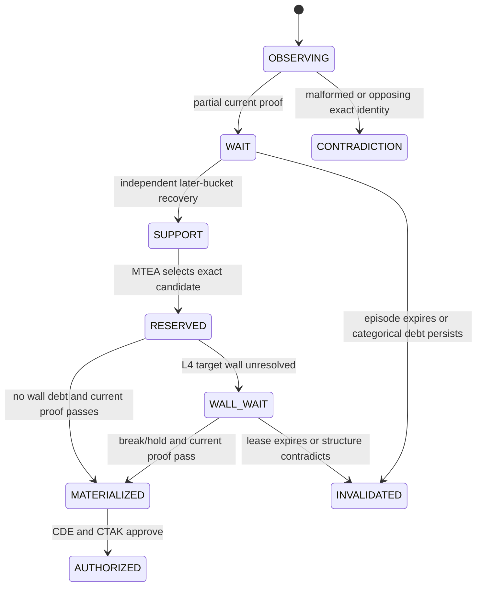
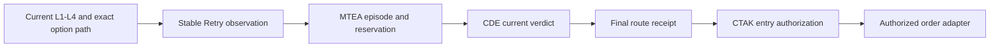

# Trend-Reversal (TR) Stable Retry

[← Momentum Ride](MOMENTUM_RIDE.md) · [White paper](README.md) · [CDE →](CDE.md)

**Component class:** Exact-token continuation and re-entry producer 
**Canonical source:** `STABLE_RETRY` 
**Execution tags:** `TR_STABLE_RETRY`, `TR_STABLE_RETRY_R`, `TR_STABLE_RETRY_BASKET` 
**Reference baseline:** `zatamap-trade-api@11ad49ec` 
**Order authority:** None

## Abstract

Trend-Reversal (TR) Stable Retry re-evaluates a directional option candidate after
an earlier flip, block, incomplete confirmation, wall wait, or temporary path
failure. Its defining principle is that retry is not permission inherited from
the prior attempt. A trade becomes eligible only after current exact-token
evidence, source-neutral temporal continuity, structural policy, and central
authorization converge through the Market-Time Evidence Authority (MTEA),
Central Decision Engine (CDE), and Central Trade Authority Kernel (CTAK). The
family contains ordinary, selected-token runner,
and basket-runner variants, each describing the proof that admitted the same
underlying strategy family.

## 1. Objective

Stable Retry addresses the interval between early recovery and fully developed
momentum. It asks:

> After a directional state change or earlier rejection, has the same market
> episode accumulated enough independent, current evidence to admit a
> trend-aligned exact option without chasing an exhausted move?

It is explicitly not:

- a periodic blind retry;
- a cached `buy_ok` override;
- a general bypass for CDE or L4 structure;
- a transfer of proof from DVR or Momentum Ride;
- a counter that turns repeated identical ticks into evidence; or
- an order-execution method.

## 2. Entry family taxonomy

| Tag | Admission proof | Position-policy implication |
| --- | --- | --- |
| `TR_STABLE_RETRY` | Ordinary current retry proof | Standard Stable Retry ladder |
| `TR_STABLE_RETRY_R` | Selected exact token proves a runner path | Runner-oriented lifecycle |
| `TR_STABLE_RETRY_BASKET` | Same-side multi-strike participation proves breadth | Basket-runner lifecycle |

The tag records provenance after authorization. It cannot be parsed to create
authority.

## 3. Input layers

Stable Retry consumes four conceptually separate layers:

1. **Layer 1 (L1) — underlying direction:** trend latch, spot displacement, swing and
   volatility context.
2. **Layer 2 (L2) — directional participation:** Call Option (CE) / Put Option
   (PE) side scores and cumulative flow.
3. **Layer 3 (L3) — option quality:** fusion score, side edge, option trend,
   premium Rate of Change (ROC), Implied Volatility (IV), Open Interest (OI),
   volume context, and selected-token sponsorship.
4. **Layer 4 (L4) — structure and location:** support/resistance wall, target distance,
   break/hold evidence, session extremes, and runway.

Those layers are current-market facts. MTEA continuity and CTAK capability are
additional contracts; they are not an L-layer score.

## 4. Baseline gating profile

The deployed reference profile uses a ten-minute master lookback and a
two-minute flip-focused lookback. Representative baseline floors are a 0.58
total fusion score, 0.08 entry edge, and stricter treatment when opposite-side
components dominate. A narrowly defined grace after 60 exchange-time seconds
may tolerate `buy_ok=False` only with a fresh snapshot, total score near 0.68,
minimum momentum near 0.25, non-negative live premium ROC, and sufficient live
strength.

The normal first retry waits 60 exchange-time seconds after a flip; opening and
counter-position paths can use shorter, separately proven intervals. Validation
is rate-limited by exchange time. A general expiry-day kill switch exists but is
disabled in the reference profile; expiry behavior is derived from the token's
contract date and current session rather than a weekday constant.

Configuration values are reported for reproducibility, not presented as
scientifically optimal constants.

## 5. Evidence state machine

Repeated callbacks in the same market-time bucket do not create independent
support. Recovery requires later, causally ordered evidence.

## 6. Current-token sponsorship

The selected option must prove its own current path. Depending on the route,
this includes:

- exact token/symbol/side identity;
- fresh premium and VWAP;
- recent premium change and smoothed ROC;
- controlled giveback and absence of live stall;
- OI/volume participation when available;
- consistent current underlying direction; and
- no early or late extended-VWAP chase condition.

Basket breadth can corroborate side quality but cannot replace the selected
contract's executable identity or current quote.

## 7. Wall-wait protocol

When L4 finds a nearby target wall, Stable Retry may arm a typed wall
reservation instead of discarding the market episode. The reservation binds
the exact candidate, wall class, market timestamp, source checks, and bounded
lifetime. Materialization requires:

- a current break/hold or equivalent structural resolution;
- exact-token and symbol continuity;
- the same authenticated market tick at the final route boundary;
- all required wall checks present and true;
- no current pre-order veto; and
- CDE approval.

An arbitrary mapping of true booleans is not sufficient. MTEA validates the
semantic receipt profile and its required check set.

## 8. Rejection and recovery semantics

Stable Retry distinguishes:

- **source-local WAIT:** incomplete producer proof; cannot veto other producers;
- **current-token veto:** current path is unsafe; blocks this exact candidate;
- **categorical debt:** coordinator, structural, ownership, or identity conflict
  requiring explicit recovery;
- **terminal invalidation:** expired/contradictory episode; and
- **audit-only reason:** explanatory text with no decision authority.

The evidence ledger uses unique exchange-time buckets. A later support fact can
recover a WAIT only when policy explicitly accepts the transition. Old formatted
reason strings are never re-parsed as evidence.

## 9. Producer versus authority boundary

The Stable Retry observation is emitted after the selected-token path has a
current result and before historical authority is reconstructed. This ordering
prevents a cycle in which MTEA history changes the producer fact that is then
fed back into MTEA.

## 10. Atomic reservation and wall lifecycle

The latest Central Trade Authority Kernel (CTAK) baseline prevents an armed
reservation from becoming an unreviewable stale-token veto. A clean sibling
contract may be observed through a typed non-executable receipt. Separate pure
authorities then evaluate current L3, opening repair, opening-impulse tail,
temporal pre-break, wall execution lifecycle, and reservation arbitration.

Only `resolve_reservation_reselection_authority_v1` may atomically rebind the
exact reservation. Until that transition succeeds, the sibling cannot execute.
A route-local soft WAIT can contribute evidence but cannot replace the final
central token or veto another current exact candidate. Wall materialization
likewise requires one typed MTEA wall-break receipt and the same current market
identity.

## 11. Relationship with DVR and Momentum Ride

- DVR can identify an earlier discounted recovery. Stable Retry accepts a
  handoff only by producing its own current exact-token evidence.
- Momentum Ride can provide side-scoped continuation. Stable Retry may add
  exact-token proof, but Momentum's WAIT cannot veto it.
- When multiple producers converge, MTEA can use the independent sources as
  temporal quorum; it cannot fabricate exact-token proof from side evidence.

## 12. Failure modes

| Failure | Control |
| --- | --- |
| Blind retry after a previous rejection | Unique-bucket evidence and explicit recovery transition |
| Reusing a stale `buy_ok` snapshot | Freshness, live strength, and live ROC constraints |
| Buying immediately below resistance | Typed L4 wall reservation and break/hold proof |
| Basket overrides exhausted selected token | Selected-token tail veto remains current authority |
| Same callback counted repeatedly | Market bucket deduplication |
| Cross-route proof collision | Source-neutral episode plus exact identity binding |
| Stale exact reservation blocks current sibling observation | Non-executable observation plus atomic central reselection |
| Variant tags treated as strategies | Canonical family taxonomy |

## 13. Observability

An evaluation event should expose:

- episode, source, candidate, side, token, and symbol;
- exchange timestamp and market bucket;
- L1/L2/L3/L4 facts and typed receipts;
- selected-token premium/VWAP path and freshness;
- current veto, categorical debt, and recovery counts;
- wall reservation/lease state;
- MTEA, CDE, and CTAK outcomes; and
- final entry-family tag if authorized.

## 14. Verification requirements

- ordinary, runner, and basket variant classification;
- unique-bucket and same-tick duplicate tests;
- stale snapshot and live-premium stall tests;
- L4 wall arm, hold, expiry, and materialization tests;
- current-L3, opening-repair, temporal-prebreak, wall-lifecycle, and atomic-reselection tests;
- cross-token and sibling-strike negative tests;
- source-local WAIT non-interference tests;
- CDE rejection and CTAK fail-closed tests;
- CE/PE symmetry and expiry/non-expiry cohorts; and
- exact replay comparison of reason codes and authority receipts.

## 15. Scientific limitations

Stable Retry has the largest policy surface among the entry producers and is
therefore most exposed to interaction effects and threshold overfitting. A
single backtest result cannot identify which gate added value. Evaluation
should use ablation studies, reason-code transition matrices, entry-delay
distributions, calibration by regime, and untouched holdout days. Family
variants must be analyzed as conditional policies rather than pooled after the
fact according to profitable outcomes.

## Implementation map

- `fusion_signals.py` — current route orchestration and configuration
- `stable_retry_evidence_cache.py` — legacy/transition evidence mechanics
- `trade_authority/adapters/stable_retry_entry_evidence.py` — typed producer seam
- `trade_authority/entry/candidate_reservation.py` — exact candidate reservation identity
- `trade_authority/entry/episode_reducer.py` — exchange-time evidence continuity
- `trade_authority/entry/current_l3.py` — current L3 authority
- `trade_authority/entry/opening_repair.py` — opening repair arbitration
- `trade_authority/entry/temporal_prebreak.py` — temporal option pre-break authority
- `trade_authority/entry/wall_execution_lifecycle.py` — wall state authority
- `trade_authority/entry/reservation_reselection.py` — atomic exact-token reselection
- `mtea_entry_authority.py` — route receipt and temporal authority validation
